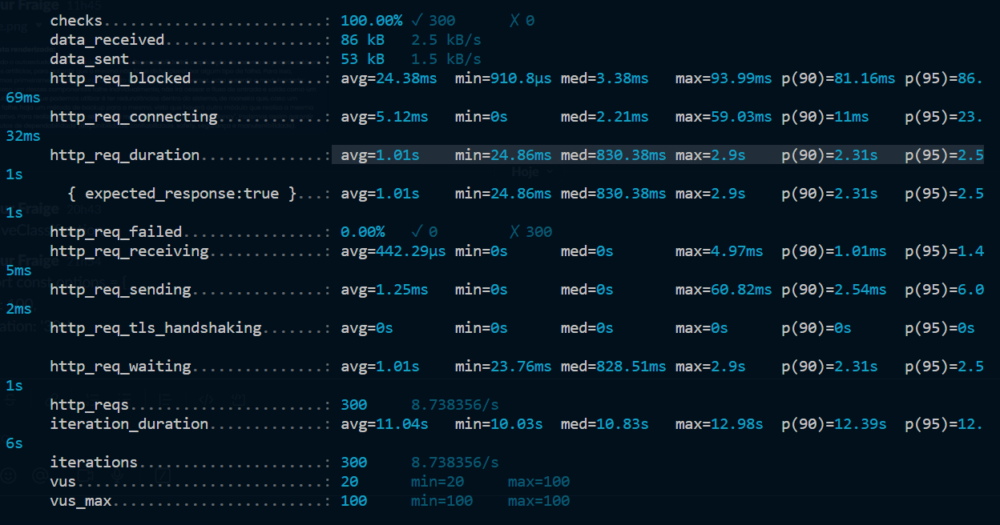
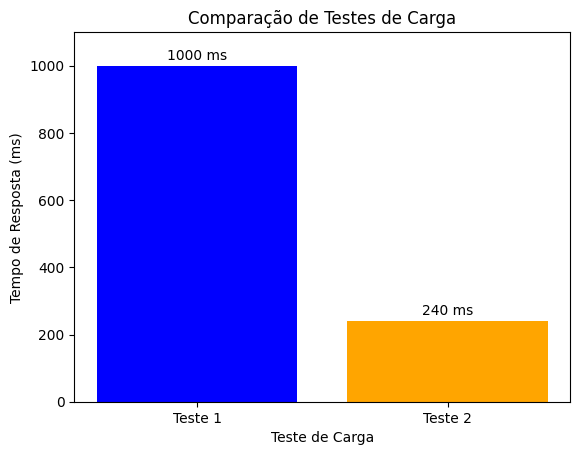

# Archicreators - Projeto de arquitetura de software

**Nome do Projeto:** Projeto de arquitetura de software

**Nome do Parceiro:** Meta

**Nome do Grupo:** ArchiCreators

**Integrantes do grupo:** Alan Schipper, Arthur Fraige, João Gonzalez, Jordan Andrade, Livia Coutinho, Sofia Pimazzoni e Victor Carvalho

### **Conteúdo**

- [Visão de Negócios](#visão-de-negócios)
- [Riscos e Oportunidades](#riscos-e-oportunidades)
- [Arquitetura do Sistema Atual](#arquitetura-do-sistema-atual)
- [Arquitetura do Sistema Novo](#arquitetura-do-sistema-novo)
- [Modelo de Simulação](#modelo-de-simulação)
- [Implementação dos Mecanismos Arquiteturais](#implementação-dos-mecanismos-arquiteturais)
- [Processo de deploy registrado](#processo-de-deploy-registrado)
- [Instruções de instalação dos componentes no projeto](#instruções-de-instalação-dos-componentes-no-projeto)
- [Revisão do modelo de simulação](#revisão-do-modelo-de-simulação)
- [Medição do novo sistema](#medição-do-novo-sistema)
- [Tradeoffs arquiteturais](#tradeoffs-arquiteturais)
- [Revisão do modelo de simulação ](#revisão-do-modelo-de-simulação)
- [Referências](#referências)
- [Apêncice](#apêndice)

# Visão de negócios
## Parceiro de negócios 

A Meta Platforms, Inc., anteriormente conhecida como Facebook Inc, é uma das empresas líderes no cenário tecnológico atual, com uma trajetória que se iniciou em 2004 com a criação do Facebook. Com sede em Menlo Park, Califórnia, a Meta se expandiu globalmente, alcançando bilhões de usuários através de suas diversas plataformas. A transição para a marca Meta em 2021 simboliza um novo foco na criação e expansão do metaverso, um ambiente digital interativo e tridimensional, visando facilitar uma conexão mais imersiva entre as pessoas, bem como entre elas e o conteúdo digital.

A Meta opera em várias frentes da tecnologia, integrando uma variedade de aplicativos e serviços, como o Facebook, Instagram, WhatsApp e Oculus, sob uma identidade corporativa unificada. Este novo posicionamento como uma empresa de tecnologia voltada para o metaverso demonstra a ambição da Meta de ir além das redes sociais e avançar na construção de um mundo digital compartilhado e interativo. 

A ênfase na inovação contínua e na criação de tecnologias que promovam uma interação mais rica e envolvente online reflete a visão da Meta de contribuir significativamente para o futuro da interação digital e da realidade virtual, redefinindo assim a maneira como as pessoas se conectam, trabalham e se divertem no ambiente digital.

## Problema

A obtenção de informações sobre compras é fundamental para uma BigTech como a Meta, pois fornece insights essenciais sobre os principais gastos da empresa, permitindo análises para otimização.
Considerando que a empresa é muito grande, e por conta disso realiza muitas compras, ela desenvolveu uma inteligência artificial que classifica as notas fiscais em 3 categorias.

O problema aparece quando a taxonomia atual dos itens de compras no sistema ERP apresentam uma assertividade de categorização inferior a 65%. Considerando isso, a solução proposta se concentra em analisar a arquitetura atual da empresa, para achar brechas de qualidades de software que possam estar comprometendo a acuracidade do sistema. Após tal processo, é necessário pensar o que na arquitetura atual terá de ser alterado para que as qualidade de software sejam cumpridas e a acurácia do sistema possa aumentar até pelo menos 95%.

## Setor de aplicação e adição de valor

A Meta opera em dois setores principais: tecnologia e publicidade. Entre eles, o setor de publicidade se destaca como a principal fonte de receita da empresa.

A possível alteração na arquitetura do sistema de classificação de compras da Meta é de extremo valor, pois auxilia a empresa a compreender onde e como seu capital é empregado. 
Com um gasto anual de aproximadamente 52 bilhões de dólares, é possível que os recursos, eventualmente, sejam alocados em áreas que não sejam estritamente necessárias.  Portanto, é fundamental analisar essas despesas, visando constantemente a redução dos custos.

## Processo de negócio e fluxos críticos suportados pelo sistema

De modo a compreender todo o fluxo de operação do sistema e observar possíveis pontos críticos, falhas e sugestões de melhoria, foi elaborado um fluxograma que mapeia todos os pontos de contato entre os clientes (time de funcionários da Meta) e os fornecedores. Essa abordagem destaca também o veículo em que ocorrem essas comunicações, além de qual a função que cada um desempenha durante o processo.

Ademais, vale ressaltar que a análise proposta leva em consideração que o pedido de solicitação de compra já foi previamente aprovado e o processo a ser realizado será o de pedido de compra, enviado para o fornecedor.

A seguir, é possível visualizar a imagem que contém o fluxograma do pedido de compra:


Como pode ser percebido a partir da imagem, o fluxo de pedido de compras segue o seguinte processo:

1- Um funcionário da Meta responsável pela emissão desse pedido acessa a plataforma "buy@", responsável por solicitar o serviço de compras para a Meta.

2- O funcionário preenche um formulário que contém todas as especificações do pedido, prazo de entrega ou conclusão, pagamento e fornecedor.

3- Durante o processo de preenchimento, a própria plataforma direciona o usuário para que todos os dados sejam preenchidos de acordo com o regimento da Meta, limitando a seleção de algumas opções de compra e preencheendo automaticamente outras para que somente empresas e formas de pagamento cadastradas possam ser solicitadas para uma região específica. Caso alguma informação não esteja de acordo com essa regulação, o envio do forumlário não pode ser concluído.

4- Caso não haja nenhuma inconformidade, o formulário é enviado para uma nova seção do "buy@", chamada "Supply Connect". Essa seção é visualizada pelos fornecedores, que recebem o pedido de compra e geram uma nota fiscal.

5- O sistema analisa os dados da nota fiscal e compara com o pedido de compra. Caso hajam informações inconsistentes, o sistema bloqueia a nota fiscal e encerra o pedido.

6- Caso não haja nenhuma inconformidade, a nota fiscal é enviada de volta para o "buy@", que realiza o pagamento automático da nota fiscal e encerra o pedido de compra.

7- Paralelamente ao preenchimento do pedido de compra, uma Inteligência Artificial (IA) analisa o conteúdo desse formulário e atribui a ele uma classificação quanto à taxonomia de pedidos de compra elaborada pela própria Meta.

### Pontos de falha e melhoria

A partir da análise do fluxograma, foram analisados possíveis pontos de melhorias ou fragilidades da aplicação, que podem ser visualizados a seguir:

* **Assertividade da Inteligência Artificial (IA)**: A correta classificação dos produtos e serviços adquiridos pela meta é de vital importância para o compliance da empresa, gestão de recursos, controle de gastos e auditoria interna e externa. Sendo assim, uma IA que categoriza erroneamente uma parcela considerável dos gastos da empresa pode gerar grandes problemas de curadoria e fiscalização no futuro, e portanto quanto maior a assertividade da IA melhor será seu valor para a empresa.

* **Preenchimento do pedido de compra**: a ampla maioria dos erros relacionados à classificação de produtos e serviços adquiridos pode estar relacionada ao fator humano, pois uma vez que os funcionários preencham de forma inadequada os dados do pedido de compra, a IA também irá realizar classificações inadequadas baseadas nesses erros cometidos.


* **Reformulação da base de treinamento da Inteligência Artificial (IA)**: Uma vez que as bases de dados que alimentam a IA responsável pela classificação das compras encontram-se corrompidas por dados imprecisos e/ou incorretos, torna-se inviável que o modelo possa obter um melhor desempenho quanto a acurácia das rotulações, visto que a origem dessa categorização fora incialmente prejudicada por dados incorretos.

  
* **Implementação de um Chat Bot**: partindo da ideia de que a maioria dos erros podem estar ligados ao fator humano, uma ferramenta que possa assistir os funcionários quanto ao preenchimento correto do pedido de compra pode ajudar a prevenir erros de inserção de informações por parte dos funcionários e melhorar a base de dados que alimenta a IA responsável pela classificação dos itens e serviços adquiridos.


* **Segurança**: Tendo em vista que notas fiscais são documentos que contém diversas informações sensíveis sobre o contratante e o contratado descritos nesses documentos, é de extrema importância que esses documentos sejam criptografadas dentro da plataforma para que possíveis vazamento de informações não exponham esses dados na web e eles possam estar seguros de agente maliciosos.


## Volumetria de transações 

A análise de volumetrias desempenha um papel crucial na compreensão e na tomada de decisões em diversos campos, desde negócios até ciência de dados. Ela envolve a avaliação de quantidades de dados ou métricas em um determinado contexto. Nesse sentido, foram criados múltiplos gráficos com a finalidade de obter insights, os principais podem ser vistos abaixo, e os demais estão contidos no link: https://github.com/2023M8T3Inteli/Grupo-01/blob/main/Volumetria/Volumetria.ipynb.

### **Análise dos principais gráficos**

**Gráfico 1: Série Temporal - Data de Pagamento x Valor Total da Compra**


</br>

Neste gráfico, exploramos a série temporal das compras em relação às datas de pagamento. Observamos uma alta volatilidade ao longo do tempo, o que indica flutuações significativas nas saídas de dinheiro. Isso pode ser um ponto de vulnerabilidade que merece atenção.

- Insight: A empresa enfrenta uma alta volatilidade nas saídas de dinheiro ao longo do tempo, o que pode afetar a previsibilidade financeira. Portanto, a volatilidade financeira pode indicar a necessidade de manter um capital de giro mais substancial para lidar com variações nos gasto e uma análise mais profunda pode ser necessária para identificar padrões ou eventos que causem picos nas saídas de dinheiro.

**Gráfico 2: Compras por Região**


</br>

Neste gráfico de barras, examinamos o valor total de compras por região. Notamos que a região NORAM (North America) representa a maioria das compras, com 79,77% do total, seguida pela EMEA (Europe, Middle East, and Africa) com 16,24%. As demais regiões contribuem com percentagens menores.

- Insight: Mais de 80% das transações ocorrem em apenas duas regiões (NORAM e EMEA), o que pode indicar uma concentração geográfica significativa. Portanto, talevz possa fazer sentido levar uma abordagem que concentra as simulações e processos de melhoria para as regiões de maior influência.

**Gráfico 3: 10 Principais Level 1 por Região**


</br>

Neste gráfico empilhado, analisamos os 10 principais fornecedores (Level 1) em cada região. Observamos que na região NORAM, uma grande percentagem de dados não foi categorizada, indicando uma falta de categorização eficaz.

- Insight: A região NORAM apresenta uma alta proporção de dados não categorizados, mostrando a necessidade de melhorar a categorização nessa área. Portanto, é possível considerar dar maior ênfase para a melhoria de acurácia nessa região, já que os dados mostram que a grande maioria dos dados não categorizados se encontram nela, é fundamental aprimorar os processos de categorização e registro de despesas para obter maior visibilidade e controle sobre os gastos principalmente nessa região.

**Gráfico 4: Proporção de Gastos pelos Principais Level 1**


</br>

Este gráfico de pizza revela a proporção de gastos pelos principais Level 1. Notamos que algumas categorias, como "Tax" e "Human Resources", representam uma parcela significativa dos gastos totais. No entanto, "Uncategorized" também tem uma representatividade considerável, destacando a influência de dados não categorizados.

- Insight: A presença de um percentual grande de dados não categorizados (Uncategorized) tem um impacto significativo nos gastos totais da empresa e pode comprometer a transparência financeira, tornando difícil para a empresa entender como os recursos estão sendo utilizados e talvez, "Uncategorized" pode estar associada a gastos desnecessários ou ineficientes que não estão sendo monitorados adequadamente pela empresa. Diante disso, esse gráfico só reforça a relevância do problema apresentado pelo parceiro.

**Gráfico 5: 10 Principais Level 1 por Valor**


</br>

Neste gráfico de barras, exploramos as 10 principais categorias (Level 1) com base no valor gasto. Destacamos que a categoria "Uncategorized" é responsável por uma parcela substancial dos gastos e está entre as 10 categorias com maior representatividade financeira.

- Insight: A categoria "Uncategorized" é responsável por uma parte relevante dos gastos e merece atenção em termos de categorização e análise. Portanto, deve-se priorizar a categorização e o monitoramento mais eficaz dos gastos em "Uncategorized" para entender o que está sendo gasto e por quê.

## Estratégia de crescimento


Visando a expansão em escala global, é necessário introduzir uma série de estratégias dentro da arquitetura para garantir uma expansão gradual e facilitada.

Dentre as estratégias a serem aplicadas, a primeira seria utilizar dados padronizados para análise e categorização, de modo que haja um pré-processamento dos dados para garantir que o sistema aceite diferentes tipos de notas fiscais e documentos, com base em uma série de parâmetros previamente definidos no sistema.

Além disso, outra estratégia a ser aplicada é garantir que o modelo de IA seja flexível, de forma que seja fácil incluir novas categorias e terminologias de produtos, permitindo que se ajuste a diferentes culturas conforme a necessidade. Uma maneira de garantir isso é descentralizar o modelo, realizando treinamento do modelo de forma regional. Isso exige um sistema de versionamento bem estruturado, para que diferentes versões do sistema sejam igualmente funcionais e atualizadas. Outro ponto importante é realizar treinamentos contínuos da IA à medida que surgem novos itens de compras e categorias. Padronizar a localização da taxonomia é outro fator importante, de modo que toda a categorização seja em inglês e de fácil entendimento globalmente. Considerando esse fator, é válido também garantir que o sistema aceite APIs de terceiros focadas na tradução de textos.

Em termos de disponibilidade, é necessário utilizar recursos de infraestrutura que tornem o sistema escalável e garantir suporte para a entrada de um grande volume de dados fiscais, que tende a crescer exponencialmente ao longo do tempo, um recurso muito valioso a ser ponderado nessa hora, é o uso de um balanceador de carga, para distribuição otimizada dos dados, dentro do sistemas. Dentro desse tópico, é importante implantar uma estratégia de segurança que garanta a privacidade desses dados, tanto externamente quanto internamente, conforme seja requisitado dentro da hierarquia empresarial. 

Por fim, duas estratégias importantes a serem consideradas são, primeiro, um plano de testes para verificar a escalabilidade, segurança e acurácia da taxonomia ao longo do tempo. Outra medida que tende a favorecer o sistema é a atribuição de um sistema de feedback do usuário, com o intuito de averiguar possíveis pontos de melhoria e facilitar a identificação de problemas durante a expansão do sistema.

## Diagrama de caso de uso


Processos do diagrama :

- Inicialmente, o "Funcionário" realiza um "Fazer Pedido".
- Em resposta ao pedido, o "Fornecedor" procede com a ação de "Emitir Nota Fiscal".
- Depois de emitida, o "Funcionário" recebe a "Nota Fiscal".
- Posteriormente, essa nota fiscal é processada pelo "Sistema de IA" que realiza uma "Classificação Automática dos Níveis do Produto".
- Com base na classificação realizada, o sistema executa uma "Análise Baseada na Classificação".


# Riscos e oportunidades
## Matriz de risco

### Matriz de Riscos do grupo em relação a entrega do projeto:

<p align="center">
 	</br>
</p>

1. Perda de interesse no projeto por parte dos membros do grupo devido à data de finalização do módulo;
2. Não entendimento ou entendimento parcial do problema proposto;
3. Problemas quanto ao uso de tecnologias desconhecidas pelo grupo;
4. Fornecimento de uma base de dados que não cumpra com nossos objetivos;
5. Requisitos mal explicados e/ou redijidos;
6. Modelo não atingir 95% de acurácia, conforme descrito no TAPI;
7. Falta de comunicação entre os membros e/ou os demais stakeholders;
8. Projeto não atingir as exepctativas do cliente nos acordos SLAs;
9. Oportunidade de futuras parcerias entre a Meta o Inteli;
10. Falta de suporte de desenvolvedor por parte da Meta para validar a arquitetura de requisitos não funcionais;
11. Aprofundar os conhecimentos em arquitetura de software pelo time desenvolvedor;
12. Alto nível de abstração no problema apresentado, ou seja, a arquitetura foi apenas comentada e não mostrada;
13. Implementação do projeto por parte do parceiro;

###  Matriz de Riscos em relação aos requisitos do sistema:

<p align="center">
 	</br>
</p>

1. Permanecer com a assertividade atual do modelo									
2. Indisponibilidade do sistema atual									
3. Sistema sem rastrabilidade dos dados									
4. Ausencia de um dado na invoice relevante para o modelo classificar corretamente 									
5. Indisponibilidade do serviço de chatbot									
6. melhorar a assertividade atual do modelo									


# Arquitetura do sistema atual

<p align="center">
	</br>
</p>

Na arquitetura, o "BUY@", é o sistema de controle de compras da META, para fazer aquisições. Após realizar uma compra, uma nota fiscal é solicitada ao fornecedor, e essa é adicionada no sistema "INVOICE". Esta nota, juntamente com variáveis do sistema BUY@ e outras externas, passa por uma Inteligência Artificial, cujo principal objetivo é ajudar na classificação da categoria da compra dentro do sistema. Esta arquitetura proporciona uma gestão eficaz e ágil das notas fiscais, otimizando o processo de compra e venda entre o comprador e o fornecedor.

## Controle dos requisitos 

### RNF01 atual: o sistema possui 65% de acurácia

**Entrada:** 65% de acurácia (pressuposto).

**Saída:** 95% de acurácia no sistema atual de classificação na região LATAM (mensurável).

**Controle do requisito:** resultados da classificação da AI comparados com a correção de tal classificação por um humano.

**Táticas arquiteturais:** </br>
Atualmente, para monitorar o requisito, é feita uma comparação da classificação da AI, com a correta classificação feita por um humano. Porém, isso só é efeito com certeza na região LATAM, que não concentra a maioria das compras. Além disso, esse método é aplicado apenas no final do processo, ou seja, só depois que a AI já classificou a taxonomia das compras de maneira errada, a empresa pede que alguma pessoa física corrija os erros.

O impacto desse requisito é muito grande de forma negativa, uma vez que com uma baixa acurácia, a classificação da taxonomia das compras da empresa ficam erradas (em sua maioria), e isso pode causar prejuízos à empresa, pois eles não irão saber com certeza onde estão gastando o seu dinheiro.


### RNF02 atual: atualmente o sistema possui rastreabilidade, mas as métricas da mesma não auxiliam a identificar falhas de categorização em prol de melhorar a assertividade

**Entrada:** Logs de erros, Logs de desempenho de infraestrutura e Logs de classificação.

**Saída:** </br>
- Logs de erros (Logs que monitoram erros que impossibilitam uma classificação de ser feita ou classificações que detém de uma acurácia muito baixa);
- Logs desempenho (Logs de desempenho do sistema, baseado no registro de rastreabilidade baseado no próprio sistema de hospedagem em nuvem);
- Logs de classificação (Logs de cada uma das classificações feitas, que trazem dados dos itens que são classificados nas compras realizadas, e outros dados como data e local);

**Controle de requisito:** O controle de requisitos atual é feito apenas por métricas básicas, que são armazenadas em arquivos CSV. Os datasets gerados atualmente funcionam como registros, não apresentando automações que aproveitem o uso dos dados para gerar insights e melhorias no modelo.

**Táticas arquiteturais:** </br>
Atualmente, a aquisição de dados desses logs está disposta em partes separadas do sistema. Primeiramente, temos os logs de desempenho, que monitoram a disponibilidade e escalabilidade e são fornecidos pelo serviço AWS. Em seguida, temos os logs de classificação, que são disponibilizados no fluxo atual, onde o usuário passa por diversas etapas manualmente, gerando registros como local, data e outros dados do item comprado. Por fim, temos os logs de erros. Quando um item não consegue ser categorizado, ele é marcado como "Undefined" dentro da base de dados, possibilitando a mensuração da quantidade de erros presentes na categorização.


### RNF03 atual: o sistema atual não dispõe de um sistema de segurança

Mesmo atualmente o sistema não dispor de segurança, e considerando que o Buy@ é um sistema de uso interno, com acesso restrito aos funcionários da Meta, a superfície de ataque é reduzida, minimizando a exposição a possíveis ameaças. Cabe destacar que o sistema atual não pode ser levado em consideração por não contar com uma mensuração do índice de segurança.

**Entrada:** O fluxo de processamento dos documentos não encontra-se criptografado, não possuindo registros de quem, quando, onde acessou, abrindo margem para vazamentos de dados e sanções da LGPD (Lei Geral de Proteção de Dados).

**Saída:** Segurança, visando a integridade, privacidade e accountability. Os dados sensíveis que serão protegidos são por exemplo o nome do fornecedor e sua localização, além do valor do pedido. O objetivo é atingir uma meta de proteção de 99,995%.

**Controle do requisito:** (não foram recebidas informações sobre como é mensurada a segurança do sistema).

**Táticas arquiteturais:** </br>
O atual fluxo de processamento de documentos carece de criptografia, carecendo de registros detalhados sobre quem acessou, quando e onde. Essa lacuna pode resultar em vazamento de dados sensíveis, o que coloca a organização em risco de potenciais sanções da LGPD, prejudicando a integridade, a privacidade e a responsabilidade (accountability) da instituição.

Atualmente, o controle do requisito de segurança, que busca alcançar uma meta de proteção de 99,995%, ainda não está claro. Não foram fornecidas informações sobre como esse requisito está sendo monitorado. A falta de detalhes sobre como a segurança do sistema está sendo avaliada e em que momento essa monitoração ocorre pode representar um risco significativo para a proteção dos dados e a conformidade com as normas de privacidade estabelecidas pela LGPD.


### RNF04 atual: o sistema deve apresentar um tempo de atividade superior a 99,9%

**Entrada:** O sistema atual não possui nenhuma forma de monitoramento de disponibilidade.

**Saída:** A disponibilidade medida esperada é 99,9%. 

**Controle do Requisito:** O teste será realizado por meio de um script implantado no ambiente de produção da Meta capaz de realizar chamadas à API central da aplicação em intervalos de 1 segundo  e observar o comportamento da aplicação ao longo de 1 dia.

**Táticas arquiteturais:** </br>
Como não foram disponibilizadas nenhum tipo de métricas de desempenho da aplicação, torna-se inviável assegurar qual seria a disponibilidade do sistema atual e averiguar se ela está de acordo com o requisito não funcional anteriormente 
proposto. Dessa forma, parte-se do pressuposto de que não existe nenhuma forma de monitoramento da aplicação atualmente e portanto será necessário que o próprio time de desenvolvedores realize um teste de disponibilidade por meio da simulação de desempenho da arquitetura. 

A alta disponibilidade é fator crucial para para o pleno funcionamento da aplicação, visto que a Meta é uma empresa global e portanto possui milhares de funcionários que podem acessar o sistema simultaneamente. Portanto, garantir que a aplicação esteja disponível na maior parte do tempo é crucial para que não ocorram atrasos nos pedidos de compra da Meta.


### RNF05 atual: o sistema possui capacidade para 30 usuários simultâneos sem perda de desempenho

**Entrada:** sistema com capacidade para 30 usuários simultâneos. 

**Saída:** sistema com capacidade para 30 usuários simultâneos (mensurável). 

**Controle do requisito:** Testes de carga sobre o sistema para verificação do desempenho sobre uma alta demanda. Pode-se usar por exemplo a ferramenta Jmeter.

**Táticas arquiteturais:** </br>
O sistema de supply da empresa suporta atualmente apenas 30 usuários simultâneos, o que é insuficiente diante do grande número de funcionários da empresa. Uma forma de monitorar essa demanda é utilizar a ferramenta Jmeter, que auxilia a medir o desempenho da aplicação sob certa carga.

Quando o sistema está sobrecarregado e se torna indisponível, a empresa não consegue classificar os itens de maneira precisa, o que pode impactar as operações diárias e a eficiência organizacional. É necessário que a capacidade do sistema seja ampliada para atender à demanda e garantir a continuidade e a eficácia dos processos de negócios.


# Arquitetura do sistema novo
## Elicitação de requisitos não funcionais

O sistema evoluído tem como objetivo principal a correção dos problemas de categorização da taxonomia de itens de compras no sistema ERP da Meta Inc. Atualmente, o sistema apresenta uma assertividade de categorização inferior a 65%, o que impossibilita a aplicação de estratégias assertivas para o planejamento de compras eficientes.

| Código | Descrição do Requisito | Justificativa do Requisito | Prioridade |
| ------ | ----------------------- | -------------------------- | ---------- |
| RNF01   | O sistema deve garantir uma assertividade mínima de 95% na classificação dos itens de compras, permitindo a correta categorização em níveis macro, subcategoria e categoria de item | A precisão na categorização é fundamental para a eficácia do sistema, permitindo estratégias de compras e pagamentos mais assertivas, o que pode, por exemplo, ajudar a evitar prejuízos como o pagamento errado de impostos | ALTA |
| RNF02   |  O sistema deve fornecer a rastreabilidade dos dados através de registros (logs) de auditoria imutáveis, que permitirão o acompanhamento desde a origem das informações até a saída. Deve também estabelecer a abrangência dos dados rastreados, os acessos permitidos e a retenção dos registros. | A rastreabilidade dos dados é fundamental para a identificação de erros, mantendo a precisão das classificações e permitindo a observabilidade proativa. Os registros imutáveis de auditoria proporcionam essa visibilidade, alinhando-se com as táticas arquiteturais e padrões ISO. | MÉDIA |
| RNF03   | O sistema precisa assegurar a integridade, confidencialidade e disponibilidade dos dados, com foco na proteção da privacidade dos detalhes de compras e na detecção proativa de acessos não autorizados ou indevidos, considerando a sensibilidade das informações contidas na taxonomia de itens de compras. | A segurança deve ser seguida de acordo com a Lei Geral de Proteção de Dados Pessoais (LGPD) para garantir a proteção a informações confidenciais e evitar perdas financeiras | ALTA |
| RNF04   |O sistema deve apresentar um tempo de atividade superior a 99,9%, considerando a importância crítica da taxonomia de itens de compras para estratégias de negócios. Isso inclui garantir a continuidade de negócios, com gestão cuidadosa da infraestrutura e do suporte para manter a disponibilidade. | Considerando que a Meta é uma empresa global com operações muito grandes e complexas, é crucial garantir a disponibilidade contínua de sua plataforma de supply para preservar a integridade de suas operações e evitar prejuízos | ALTA |
|	RNF05	| O sistema processará 95% das requisições em tempo igual ou inferior a 900 milissegundos, com taxa de erro de resposta inferior a 5%, mesmo diante de um volume estimado de 3.000 requisições por minuto em situações normais de uso. | Para garantir a assertividade nas classificações mesmo sob altas cargas, é crucial que a aplicação mantenha um desempenho satisfatório, processando a maioria das requisições dentro de um intervalo de tempo específico, minimizando erros de resposta. Esse ajuste permite definir padrões claros para o desempenho esperado da aplicação e como ela deve reagir sob altas demandas.| ALTA |
|	RNF06	| O sistema do ChatBot deve ser otimizado e eficiente para garantir que todas as respostas às descrições dos usuários sejam geradas e retornadas em um tempo máximo de 10 segundos, contados a partir do momento em que a descrição do pedido do usuário é recebida pelo sistema. | Após o usuário colocar toda a descrição do produto, o ChatBot terá no máximo 10 segundos para retornar uma possível classificação para o pedido, pois mais que isso pode interferir negativamente na usabilidade do sistema.| ALTA |
|	RNF07	| O sistema do ChatBot deve ser altamente disponível, assegurando uma taxa de disponibilidade de 99,5% para garantir que os usuários possam acessar e interagir com o ChatBot a qualquer momento, sem interrupções significativas, o que permite a classificação mais assertiva dos itens. | Considerando o uso mútuo da aplicação, é desejável que ele esteja disponível para uso a todo momento, pois se a classificação estiver correta logo de início, é possível utilizá-la para o treinamento.| MÉDIA |

O sistema evoluído visa solucionar os problemas de categorização da taxonomia de itens de compras, promovendo maior precisão e eficiência nas operações de compras da Meta Inc. Os requisitos não funcionais críticos foram selecionados com base nas vulnerabilidades identificadas no sistema atual, priorizando a precisão, a rastreabilidade, a segurança e a disponibilidade. Esses requisitos são fundamentais para atender às expectativas dos gestores e demais executivos, permitindo estratégias de compras mais assertivas e reduzindo o trabalho manual de reclassificação de dados.

## Propostas de melhoria

Para atingir os requisitos não funcionais acima, foi pensado em alguns fatores que poderiam contribuir para a melhorar a arquitetura como um todo. Inicialmente, considerando a quantidade de informações conhecidas sobre o sistema da empresa, foi pensado apenas em dois meios de mellhorar a acurácia da inteligência artificial, sendo eles, um ChatBot e uma melhor distribuição das AIs.

O ChatBot terá a função de auxiliar o usuário que vai preencher os dados de um contrato a selecionar corretamente as 3 categorias de compra. Para fazer isso, ele vai associar a descrição da compra do usuário com outras compras do banco de dados, para buscar se existe alguma parecida com a inicial. Caso exista, o ChatBot irá mostrar uma mensagem na tela como "baseado na solicitação de compra de outros usuários, recomendo que você classifique essa como L1 = Professional Services, L2 = Financial Services e L3 = Taxes".

Já o conceito de distribuir melhor a AI, gira em torno de uma análise que foi feita em cima da base de dados das compras desse ano. Nessa análise foi possível descobrir que aproximadamente 79% das compras se concentra na América do Norte, ou seja, dividir a inteligência artifical por regiões, ainda mais que cada uma retorna um tipo de nota fiscal diferente, pode ser uma boa opção para ajudar a melhorar a acurácia do sistema. Além disso, aproximadamente 16% das compras se concentram no ENEA (Europa, África e Oriente Médio), mas como são regiões com culturas muito diferentes, é importante avaliar se vale a pena seperar a AI por região ou país.


## Controle dos requisitos 

### RNF01 novo: o sistema possui 95% de acurácia

**Entrada:** 95% de acurácia do sistema atual de classificação na região LATAM (mensurável). 

**Saída:** 95% de acurácia no sistema de classificação em todas as regiões. 

**Controle do requisito:** Curadoria de classificações (sejam elas realizadas de forma automatizada, ou de forma semi-automática com chatbot) considerando uma amostra com classificações de todas as regiões, em que iremos usar como base de comparação a classificação realizada por um especialista humano de forma completamente manual em um conjunto menor, porém representativo de todas as regiões.

**Táticas arquiteturais:** </br>
Para melhorar o sistema atual da empresa, foi sugerido a implementação de um ChatBot, que irá sugerir ao usuário uma possível classificação para o seu problema. Ele iria aparecer para o usuário no momento de classificar o pedido de compra, pois assim seria uma maneira de evitar a classificação incorreta logo de início. Além disso, outra possibilidade é desenvolver uma inteligência artificial separada para a análise de notas fiscais similares, já que uma única AI pode ter dificuldade de entender diferentes modelos. Esse processo seria aplicado na própria fase de classificação, mas certamente haveria uma maneira de todas essas AIs se comunicarem no final, como uma mesma base de dados de compra, por exemplo.
Por fim, para monitorar se essas soluções realmente estão sendo efetivas, seria necessário realizar uma curadoria, tanto para o sistema do Chatbot, quanto para o sistema das AIs.

O impacto desse requisito para a empresa é muito grande de forma positiva, uma vez que tendo uma acurácia da AI mais alta, as compras feitas pela empresa serão classificados na taxonomia correta, e ela terá um maior e melhor controle de seus gastos.


### RNF02 novo: o sistema passará a ter métricas de rastreabilidade, a partir da implementação de logs dentro da arquitetura

Com os dados disponibilizados pelos logs, será possível esquematizar uma sistema novo de testes que ajudará a garantir a assertividade do sistema de taxonomia, a longo prazo.  

**Entrada:** Logs de classificação, Logs da probabilidade de classificação, Logs de erros, Logs do histórico de treinamento do modelo, Logs de atualização da Taxonomia, Logs de feedback do usuário, Logs de acesso ao sistema, Logs de desempenho de infraestrutura, Logs de atualização do sistema, Logs de integrações externas. </br>

**Saída:** </br>
- Logs de classificação (dados relativos à classificação como data, hora e informações do item, em prol de verificar picos baixos de desempenho baseado no momento do dia ou no tipo de item);
- Logs da probabilidade de classificação (dado provido pelo modelo da porcentagem de confiabilidade da classificação atribuída, esse dado fornece auxílio na monitoria da assertividade a longo prazo);
- Logs de erros (erros no processo de classificação que impossibilitaram de um item ser classificado, ou que teve um índice de assertividade muito baixo, identificar esses erros com facilidade é essencial para formar planos de ação de reparos ou atualizações);
- Logs do histórico de treinamento do modelo (dados do índice de desempenho do modelo e atualização dos hiperparâmetros, em prol de verificar se a atualização dos hiperparâmetros afeta o desempenho ou assertividade do modelo);
- Logs de atualização da Taxonomia (Monitorar adição ou remoção de parâmetros da taxonomia e como essas ações podem afetar o modelo);
- Logs de feedback do usuário (Feedbacks feitos de forma manual pelo usuário, indicando se uma classificação foi correta ou não, em prol de averiguar se está de acordo com o índice de confiabilidade do modelo);
- Logs de acesso ao sistema (Dados do índice de acesso ao acesso ao sistema, para ver se número de usuários ativos está afetando a disponibilidade do sistema, e verificar se esse índice afeta a confiabilidade do modelo);
- Logs de desempenho de infraestrutura (Ter dados relativos ao tempo de resposta do sistema, disponibilidade e escalabilidade para verificar se são necessários ajustes na arquitetura ao longo do tempo, para deixar esses parâmetros do sistema alinhados com requisitos do sistema);
- Logs de integrações externas (Monitorar adição ou remoção do uso de API’s externas dentro do sistema, e se elas afetam o desempenho do sistema como um todo); </br>

**Controle de requisito:** Exportação automática do sistema de diversos datasets com os dados de cada um dos logs. Os dados utilizados servirão para serem utilizados em modelos diversos de comparação e modelos que geram gráficos para termos visualizações constantes dos dados ao longo do tempo e ao longo das atualizações do sistema.

**Táticas arquiteturais:** </br>
Como pode ser visto, a monitoração da rastreabilidade do sistema ocorrerá por meio de logs, que serão implementados em pontos diferentes da arquitetura, incluindo o uso do Apache Kafka. Os logs de classificação estarão implementados dentro do código do modelo de classificação, onde toda vez que o modelo rodar, esses dados serão emitidos com os parâmetros de logs descritos na saída. Os logs de probabilidade também se encontram dentro do modelo, e igualmente, toda vez que houver uma classificação, o sistema emite um valor percentual da assertividade estimada para aquela classificação. Para os logs de erros, os mesmos serão implementados dentro do modelo e serão registrados a partir do evento de, primeiro, caso haja um erro que faça o modelo não rodar a classificação, seja por uma questão de inputs insatisfatórios, ou segundo, por uma questão de índice de assertividade muito baixo, até então definimos em menos de 60% de assertividade na classificação. Os logs de feedback do usuário serão implementados dentro do front-end da aplicação, onde o usuário dará um feedback se a classificação foi correta ou não manualmente, emitindo um dataset binário, para avaliar a assertividade. Os logs de acesso ao sistema serão rastreados nas requisições de acesso à plataforma, podendo ser processados e armazenados através do Apache Kafka para uma melhor gestão de eventos e auditoria. Os logs de desempenho da infraestrutura serão disponibilizados automaticamente pelo provedor em nuvem, e os logs de integrações externas serão feitos a cada atualização do sistema, onde o controle de versionamento emitirá logs de sistemas terceiros adicionados ou retirados, possibilitando uma visão clara das mudanças na integração. Por fim, ambos os logs do histórico de treinamento do modelo e logs de atualização da taxonomia serão emitidos a cada atualização dos hiperparâmetros do modelo, a partir do controle de versionamento, permitindo o rastreamento completo das mudanças ao longo do tempo.  

O impacto disso será na elaboração de estratégias para melhorar o sistema e automatizar mais processos caso haja demanda, o que irá auxiliar muito durante o processo de expansão global do sistema.


### RNF03 novo: O sistema conta com uma proteção de 99,995%

**Entrada:** O sistema conta com uma proteção de 99,995% e o seu fluxo de processamento dispõe de criptografia.

**Saída:** O sistema conta com uma proteção de 99,995% e o seu fluxo de processamento dispõe de criptografia.

**Controle do requisito:** Introdução de um sistema de monitoramento que registra cada acesso aos documentos, incluindo informações como usuário, horário, local e tipo de ação realizada, proporcionando um controle mais eficiente sobre a integridade e privacidade dos dados. Para verificação do quão suscetível a invasões o sistema encontra-se, cabe a realização de testes de segurança como o pentest (penetration test) e o SQL Injection, além de simulação de ataques de phishing  para verificar como os funcionários respondem a e-mails falsos ou solicitações enganosas.

**Táticas arquiteturais:** </br>
O novo requisito estabelece que o sistema garanta uma proteção de 99,995% para as informações. Esta atualização visa aprimorar a segurança do sistema, garantindo a integridade e privacidade dos dados, que anteriormente estavam comprometidos devido à ausência de um sistema de monitoramento eficaz.

A introdução de um sistema de monitoramento que registra cada acesso aos documentos, incluindo informações sobre usuário, horário, local e tipo de ação realizada, busca fornecer um controle mais eficiente sobre a integridade e a privacidade dos dados. No entanto, é fundamental a implementação de métricas para avaliar continuamente a conformidade do sistema em relação à meta de proteção de 99,995%. A verificação contínua dos registros de auditoria será essencial para assegurar que o nível de proteção esteja sendo atendido, garantindo a eficácia do sistema e o cumprimento dos requisitos de segurança estabelecidos.


### RNF04 novo: o sistema deve apresentar um tempo de atividade superior a 99,9%

**Entrada:** A disponibilidade medida esperada é 99,9%.

**Saída:** A disponibilidade medida esperada é 99,9%.

**Controle de Requisito:** O teste será realizado por um script similar ao descrito no artefato 1. Todavia, além das chamadas à API central da aplicação, esse novo script também realizará chamadas periódicas às API’s que conectam o Chatbot proposto com a IA responsável por realizar NLU (Neural Language Understanding) e a IA responsável por categorizar as taxonomias de compra.

**Táticas arquiteturais:** </br>
Visando manter o monitoramento dessas API’s, será utilizado a plataforma “Uptime Kuma”, que uma vez instalada via docker na aplicação realiza diversas requisições ao longo do dia para API desejada, além de gerar gráficos de desempenho, KPI’s e alertas caso ocorra alguma mudança configurada como significativa, como a plataforma se encontrar fora do ar por mais de 5 minutos ou a resposta demorar mais de 90 segundos.

O monitoramento da aplicação desempenha um papel crucial para manter a integridade do sistema e corrigir erros de maneira rápida para que pequenas falhas não possam causar um impacto tão grande ao funcionamento do sistema. Dessa forma, o sistema de alertas nativo do “Uptime Kuma” se mostra uma excelente estratégia para que um time de desenvolvedores responsáveis por monitorar a aplicação seja notificado em tempo real sobre mudanças de comportamento e estado do sistema e possam corrigir da melhor maneira possível essa alteração


### RNF05 novo: o sistema possui capacidade para 3.000 usuários simultâneos sem perda de desempenho

**Entrada:** sistema com capacidade para 3.000 usuários simultâneo.

**Saída:** sistema com capacidade para 3.000 usuários simultâneos (metrificados).

**Controle do requisito:** Testes de carga sobre o sistema para verificação do desempenho sobre uma alta demanda. Pode-se usar por exemplo a ferramenta Jmeter.

**Táticas arquiteturais:** </br>
O sistema de supply da Meta será aprimorado para suportar até 3.000 usuários simultâneos, uma mudança necessária para atender à crescente demanda do número de funcionários da empresa. A limitação anterior impactava as operações diárias e a eficiência organizacional. Com o aumento previsto na capacidade, espera-se que o sistema opere sem interrupções ou perda de desempenho, mesmo sob alta demanda, assegurando a continuidade e a eficácia dos processos de negócios, o que causa um impacto muito positivo para a empresas. Para essa melhora será proposto a expansão de seus servidores tanto verticalmente (aumentar a capacidade dos servidores existentes ) como horizontalmente (adicionar mais servidores para distribuir a carga), além disso a implementação de balanceadores de carga para distribuir o tráfego de maneira eficiente. Por último, também é válido pensar na possibilidade de adicionar um sistema de filas, pois assim as requisições pelo menos não irão sobrecarregar o sistema.


### RNF06 novo: o chatbot deve retornar a resposta em no máximo 10 segundos

**Entrada:** o sistema atual não existe e por isso não possui nenhuma forma de medir se a resposta está sendo retornada em um tempo adequado.

**Saída:** logs e dashboards do tempo de resposta para as requisições do sistema.

**Controle do requisito:**
Para atender ao requisito de que o chatbot deve retornar uma resposta em no máximo 10 segundos, é essencial implementar um sistema abrangente de monitoramento e controle. Nesse sentido, é fundamental registrar logs detalhados durante as interações do chatbot. Esses logs devem incluir informações como timestamps, identificadores de sessão exclusivos, estados do chatbot, perguntas dos usuários(input de descrição), respostas fornecidas(output de classificação) e o tempo de resposta associado a cada interação. Para isso, é possível aplicar a ELK Stack (Elasticsearch, Logstash e Kibana), que desempenha um papel essencial na gestão eficiente de logs e monitoramento contínuo do desempenho do sistema.

**Táticas arquiteturais:** </br>
Considerando o controle do requisito mencionado anteriormente, a próxima etapa envolve a configuração do Logstash como componente central dessa pilha, o que inclui a definição de pipelines, permitindo especificar as etapas de processamento necessárias para enriquecer os dados registrados e transformações, como a inclusão de campos adicionais, ajustes de timestamps e aplicação de filtros, que são executadas para garantir que apenas informações relevantes e formatadas corretamente sejam encaminhadas ao Elasticsearch. Depois disso, acontece a configuração do Elasticsearch para armazenar esses logs de maneira eficiente e o Kibana para proporcionar visualizações e dashboards personalizados. Ao estabelecer um mapeamento de índice adequado no Elasticsearch, garantimos que os dados sejam organizados de forma a facilitar a análise subsequente.
</br>
No Kibana, é crucial criar dashboards que ofereçam uma visão clara do desempenho do chatbot. Elementos como tempo médio de resposta, distribuição de tempos de resposta e o número de consultas ao longo do tempo devem ser incorporados nas visualizações. A configuração de alertas no Kibana também é recomendada, permitindo notificações automáticas caso o tempo médio de resposta ultrapasse limites predefinidos, em nosso caso, de 10 segundos.
</br>
Além disso, é importante estabelecer um processo de análise periódica dos logs e dashboards por parte de um time de negócios. Durante essas revisões, o time pode identificar tendências de desempenho, detectar problemas recorrentes e desenvolver estratégias para otimizar a eficiência do chatbot. Essas análises proporcionam insights valiosos que podem orientar melhorias contínuas no chatbot.
</br>
Por último, é importante ter uma documentação adequada dos insights obtidos por meio do monitoramento e implementar continuamente as melhorias identificadas. Ao seguir essas etapas, cria-se um ambiente robusto para garantir que o chatbot atenda ao requisito de resposta em no máximo 10 segundos, ao mesmo tempo em que oferece oportunidades constantes de aprimoramento e adaptação às necessidades do usuário. 


### RNF07 novo: a disponibilidade do sistema do ChatBot é de 99,5%.

**Entrada:** O sistema atual não existe e por isso não possui nenhuma maneira de medir a disponibilidade.

**Saída:** Alcançar 99,5% de disponibilidade no sistema novo do ChatBot.

**Controle do Requisito:** Implementar monitoramento em tempo real do sistema para garantir e verificar a disponibilidade prometida, usando ferramentas de gerenciamento de TI e alerta automatizados. Além disso, é necessário configurar balanceadores de carga nos servidores da empresa.

**Táticas arquiteturais:** </br>
O monitoramento da infraestrutura em tempo real pode ser feito por meio de uma plataforma como o Uptime Kuma, além da implementação de uma configuração de alertas automáticos para notificar a equipe técnica imediatamente quando a disponibilidade cair abaixo dos limiares estabelecidos. Essa plataforma poderá ser acessada a qualquer momento. Como o Chatbot será hospedado em datacenters físicos da própria empresa por questões de segurança, será necessário também ficar atento às configurações e estados dos balanceadores de carga.

A alta disponibilidade do Chatbot terá um impacto alto e positivo para a empresa, já que considerando que terão menos interrupções, a produtividade dos usuários irá aumentar e o risco de ocorrer uma classificação errada será diminuído.


# Modelo de simulação

## Diagrama Estrutura Estática do Modelo

<p align="center">
	</br>
</p>

O diagrama ilustra o plano de aprimoramento do sistema por meio de alterações na arquitetura, com a inclusão de novos requisitos para aprimorar o funcionamento do sistema com o objetivo de obter assertividade de 95% dos itens classificados.

## Elementos e parâmetros de simulação:

**Sistema Atual**: Representa o sistema atual que é usado para classificar os itens.

**Melhoramento da arquitetura:** Visa melhorar a estrutura atual do sistema para atingir o objetivo de assertividade das classificações em 95%.

* *Implementação de chatbot:* Por meio das classificações dos itens e de suas respectivas descrições, o chatbot ajudará o usuário a classificar de forma melhor os itens. O chatbot processa a descrição do item e busca por uma descrição parecida no banco de dados assim se espera uma melhora na classificação dos itens.

	* *Exemplo de como o processamento baseado em filas poderia ser utilizado:* 
	No contexto de simulação de acessos simultâneos, pode-se entender que, ao implementar o chatbot, múltiplos usuários podem inserir descrições simultaneamente. O sistema, então, teria que lidar com filas de processamento e paralelismos para evitar atrasos.


* *Melhoramento do modelo:*  O aprimoramento do modelo é um requisito importante para melhorar a precisão das classificações. Por meio de técnicas de aprendizado de máquina, serão utilizados os dados fornecidos pela Meta para recriar um modelo melhor.

* *Rastreabilidade dos Dados:* Garante que a origem dos dados seja conhecida e que seu fluxo possa ser monitorado.

* *Segurança:* Visa proteger o sistema de acessos não autorizados e garantir a integridade das informações.

* *Disponibilidade:*  Garante que o sistema esteja disponível para uso. 

*Sistema Novo:* Representa o sistema após a implementação dos requisitos para obtenção do resultado esperado de 95% de assertividade nas classificações.

1. Elementos do sistema envolvidos em cada Requisito não Funcional (RNF):

*Rastreabilidade dos Dados:* Dados, NLP, Implementação de chatbot.
*Segurança:* Dados, Implementação de chatbot, Sistema Novo.
*Disponibilidade:* Sistema Novo.

2. Estrutura e conexão entre esses elementos:

A estrutura apresenta uma sequência lógica, começando pelo "Sistema Atual", passando por melhorias na arquitetura e implementação de ferramentas adicionais como o chatbot e o NLP. Estes elementos estão interconectados, com o NLP atuando diretamente sobre os dados, resultando em uma classificação que é então produzida como "Output". Além disso, há um foco considerável na qualidade dos dados, sua segurança e rastreabilidade, garantindo que o sistema seja robusto e confiável.

## Código das simulações:

Foi realizado a simulação do sistema em quatro diferentes cenários de assertividade na classificação dos itens. Todas as simulações foram feitas utilizando a Cadeia de Markov, pois, é uma abordagem boa para simulações de software, que fornece aos desenvolvedores uma ferramenta poderosa para modelar sistemas complexos, prever comportamentos futuros, analisar desempenho e tomar decisões estratégicas fundamentadas em dados probabilísticos.

### 1. Simulação do Sistema Atual

* A simulação do sistema atual foi feita com base na assertividade do sistema atual descrito pela Meta. O sistema conta com 65% de assertividade na classificação dos itens.
* A simulação está diretamente ligada ao risco "Manutenção da Assertividade Atual do Modelo", identificado como risco número 1 na matriz de riscos relacionada aos requisitos do sistema. Este representa um risco significativo, impactando a Meta de diversas maneiras, incluindo pagamentos incorretos de impostos devido a erros na classificação de itens, impacto negativo na receita da empresa, alocação inadequada de recursos e tempo valioso dos funcionários gasto em reclassificação desnecessária.

A matriz de transição de estado é: 

$$
\begin{bmatrix}
0,65 & 0,35 \\
0,35 & 0,65 
\end{bmatrix}
$$

Resultados obtidos em uma amostra com classificação de 100.000 itens:

<p align="center">
	</br>
</p>

### 2. Sistema Novo

* A simulação do sistema novo considera o sistema como se espera chegar no final, ou seja, um sistema que apresente 95% de classificações corretas de itens. 
* Essa simulação se associa a oportunidade "Melhorar a assertividade atual do modelo", item 6 da matriz de riscos associada aos requisitos do sistema. 

A matriz de transição de estado é:

$$ 
\begin{bmatrix}
0,95 & 0,05 \\
0,5 & 0,95 
\end{bmatrix}  
$$

Resultados obtidos em uma amostra com classificação de 100.000 itens:

<p align="center">
	</br>
</p>

O código das simulações se encontram em: Simulacao/simulacao.ipynb

### 3. Sistema após implementação do chatbot

* A simulação do sistema após a implementação do chatbot, considera uma melhora na assertividade das classificações para 70%. 
* Se assimila ao risco 5 "Indisponibilidade do serviço de chatbot" conforme identificado na matriz de riscos associada aos requisitos do sistema.

A matriz de transição de estado é: 

$$ 
\begin{bmatrix}
0,70 & 0,30 \\
0,30 & 0,70 
\end{bmatrix}  
$$

Resultados obtidos em uma amostra com classificação de 100.000 itens:

<p align="center">
	</br>
</p>

### 4. Simulação do sistema atual indiponível

* A simulação do sistema atual indisponível simula a assertividade do sistema atual quando está indisponível. De acordo com a Meta, esse sistema suporta apenas 30 usuários simultâneos. Para simular a queda da API e a classificação dos itens foi utilizado duas matrizes de transição, uma representa a transição de estado "disponível" para "indisponível" e a outra simula a assertividade do sistema atual. 
* A simulação está vinculada ao risco 2, "Indisponibilidade do Sistema Atual", conforme identificado na matriz de riscos associada aos requisitos do sistema. Esta indisponibilidade tem consequências significativas, incluindo uma redução drástica na assertividade das classificações, efetivamente atingindo um valor nulo. Isso acarreta em pagamentos indevidos de impostos devido a erros na classificação dos itens, afetando diretamente a receita da empresa. Adicionalmente, resulta na alocação de recursos em áreas inadequadas e no desperdício de tempo valioso dos funcionários, que são forçados a reclassificar itens manualmente. Este cenário não só prejudica a eficiência operacional, mas também tem um impacto negativo direto na saúde financeira da organização.  

A matrizes de transição de estado são respectivamente:

$$
\begin{bmatrix}
0 & 1 \\
1 & 0 
\end{bmatrix}
$$

$$ 
\begin{bmatrix}
0,65 & 0,35 \\
0,35 & 0,65 
\end{bmatrix}  
$$

Resultados obtidos em uma amostra com classificação de 100.000 itens:

*API funcionando enquanto tem menos de 30 usuários:*

<p align="center">
	</br>
</p>

*Classificação dos itens com a transição de estado "disponível" para indisponível:*

<p align="center">
	</br>
</p>

Note que a primeira classificação (sistema ainda disponível) tem chance de 65% de estar correta. Entretanto, após a queda do sistema todas as classificações são dadas como incorretas. Isso ressalta a importância do sistema ter alta disponibilidade.

*Erro da 400 da API:*

<p align="center">
	</br>
</p>

### 5. Simulação ChatBot indisponível

* O chatbot tem a função de ajudar os funcionários da Meta a preencher os campos de input do sistema de supply.
* A simulação do chatbot demostra a assertividade do sistema quando o chatbot passa de disponível para indisponível. Com o chatbot disponivel na aplicação o sistema melhorará para 85% de assertividade.  Para simular a queda da API e a classificação dos itens quando o sistema está em estado disponível ou em indisponível foi utilizado três matrizes de transições, uma representa a transição de estado "disponível" para "indisponível", a segunda simula a assertividade do sistema de chatbot disponível e a terceira a assertividade do sistema de chatbot indisponível. Como o chatbot proposto será um microsserviço se caso ele estiver indisponível a aplicação continua com sua assertividade original de 65%. Na simulação a API entra em estado indisponível quando 3000 usuários entram simultaneamente na aplicação
* Essa simulação se associa ao risco "Indisponibilidade do serviço de chatbot". Com a falha do chatbot a aplicação voltará a assertividade original de 65% de classificações corretas.

As matrizes de transição de estado são:

Estado de transiçoes de disponivel para indisponivel:

$$
\begin{bmatrix}
0 & 1 \\
1 & 0 
\end{bmatrix}
$$

Estado disponivel - Estado de transiçoes de correto para incorreto:

$$ 
\begin{bmatrix}
0,82 & 0,18 \\
0,18 & 0,82 
\end{bmatrix}  
$$

Estado indisponivel - Estado de transiçoes de correto para incorreto:

$$ 
\begin{bmatrix}
0,65 & 0,35 \\
0,35 & 0,65 
\end{bmatrix}  
$$

As métricas da Matriz de transição do chatbot disponível foram retiradas do modelo já feito pelo grupo para implementar o chatbot. Resultados obtidos no modelo:

<p align="center">
	</br>
</p>

O código do modelo do chatbot se encontra em: Simulacao/modeloChatBot.ipynb

Resultados obtidos na simulação com uma amostra de 100 itens classificados para 3 usuários simultâneos:

<p align="center">
	</br>
</p>

<p align="center">
	</br>
</p>

<p align="center">
	</br>
</p>

Nesse momento o chatbot está disponível e com uma assertividade das classificações de aproximadamente 82%.

Resultados obtidos na simulação com uma amostra de 100 itens classificados para o usuários 3001:

<p align="center">
	</br>
</p>

Nesse momento o chatbot está indisponível, pois sua capacidade de 3000 usuário foi superada. Assim a assertividade das classificações voltam para 65% do sistema original.

O código das simulações se encontram em: Simulacao/simulacaoChatbotIndisponivel.ipynb

O código também pode ser acessado pelo link do Colab: [https://colab.research.google.com/drive/1_St2Fc7JvPZ31QOT80QzVix05moIfiFf?usp=sharing](https://colab.research.google.com/drive/1_St2Fc7JvPZ31QOT80QzVix05moIfiFf?usp=sharing)


### Simulação de teste de carga feita com JMT

Atualmente o sistema suporta 30 usuários simultâneos, e o objetivo é aumentar esse número para 3000. Como pode ser visto no requisto não funcional 5 do sistema novo, uma das formas propostas de ajudar esse número é utilizando filas. Para realizar a simulação de tal proposta, foi utilizado o software JMT (simulador de filas). Nele, foi construído um sistema com uma entrada de 3000 (que representa os usuários), e uma etapa de processamento que  aguenta 3500 requisições. Abaixo, estão os resultados dessa simulação.

Essa primeira análise contempla o “queue time”, ou seja, o tempo que as requisições ficaram esperando na fila. Como é possível visualizar, o tempo é quase nulo, sendo 1.65 elevado a -3. Isso significa que as requisições estão sendo processadas com certa facilidade e o sistema não está sobrecarregado, já que ele consegue cumprir com a quantidade certa que chega.

<p align="center">
	</br>
</p>

Nessa segunda análise, é possível ver a utilização do sistema, que nessa simulação em específico foi equivalente a 86%. Isso significa que uma fila que processa até 3500 itens e recebe em média, 3000 por minuto, utiliza cerca de 80% da sua capacidade de processamento. Considerando tal fator, é válido pensar em aumentar a capacidade dessa fila ou adicionar uma outra ao mesmo sistema, pois é recomendado que um sistema não ultrapasse 80% da sua capacidade de processamento.

<p align="center">
	</br>
</p>

### Nova simulação da arquitetura

A simulação aprimorada representa o sistema de supply chain atual da Meta, onde um cliente simula o fluxo de entrada do sistema. Este sistema é suportado por uma arquitetura de microserviços, com três servidores dedicados que atuam em uma sequência de classificações. Cada servidor é especializado em uma etapa distinta do processo de classificação, garantindo uma classificação ideal para os itens.

<p align="center">
	</br>
</p>

Na simulação foi considerada uma distribuição de tempo de chega exponencial de um usuário por unidade de tempo, conforme mostra a foto abaixo:

<p align="center">
	</br>
</p>


Além disso, foi configurado a mesma taxa de distribuição de tempo de serviço para todos os servidores, isso porque todos realizam tarefas idênticas, ou seja, nenhum deles tem uma carga diferente de serviço.

<p align="center">
	</br>
</p>

Resultados obtidos:

Os índices de performance foram definidos para verificar se a arquitetura está de acordo com os requisitos, disponibilidade, tempo de resposta e desempenho do sistema.

* Índice Utilização do sistema:

Esta métrica indica a fração de tempo que os recursos do sistema (neste caso, servidores) estão sendo usados, ou seja, está diretamente correlacionado com a disponibilidade da aplicação. Uma alta utilização pode significar boa eficiência do sistema e economia de recursos de software e hardware, mas se for muito alta, pode levar a atrasos devido à sobrecarga dos servidores e das filas. A utilização é diretamente relacionada à disponibilidade do sistema, ou seja, quanto mais disponível um servidor estiver, melhor poderá responder a variações na demanda.

Servidor 1:

<p align="center">
	</br>
</p>

Servidor 2:

<p align="center">
	</br>
</p>

Servidor 3:

<p align="center">
	</br>
</p>

Conclusão:

A utilização média em todos os servidores é próxima de 67%, o que indica um nível de atividade consistente e moderado. Estes valores sugerem que há uma margem de capacidade disponível para lidar com aumentos eventuais na demanda sem que haja risco de saturação dos servidores. A simulação mostra que o sistema está equilibrado e que cada servidor contribui de forma semelhante para o processamento das tarefas.

* Índice Tempo de Resposta do sistema:

O objetivo da simulação é avaliar o tempo de resposta de cada servidor sob uma taxa de chegada constante de 1 usuário por unidade de tempo.

Servidor 1:

<p align="center">
	</br>
</p>

Servidor 2:

<p align="center">
	</br>
</p>

Servidor 3:

<p align="center">
	</br>
</p>

Conclusão:

Os tempos de resposta médios são consistentes entre os servidores, indicando um sistema bem balanceado. As médias dos tempos de resposta estão em torno de 2 unidades de tempo, o que sugere que o sistema é capaz de atender os usuários de forma eficiente, considerando a taxa de chegada estabelecida.

* Índice Throughput (vazão) do sistema:

Representa o número de unidades de trabalho que o sistema pode processar em uma unidade de tempo. Esta métrica está relacionada ao desempenho, pois reflete a capacidade do sistema de lidar com a carga de trabalho. Um throughput alto, mantendo os tempos de resposta aceitáveis, indica um sistema de alta performance.

Sistema Atual:

<p align="center">
	</br>
</p>

Servidor 1:

<p align="center">
	</br>
</p>

Servidor 2:

<p align="center">
	</br>
</p>

Servidor 3:

<p align="center">
	</br>
</p>

Sistema completo:

<p align="center">
	</br>
</p>

Conclusão:

Os resultados indicam uma vazão quase uniforme em todos os servidores e no cliente, com uma média próxima de 0.99 itens por unidade de tempo. Isso sugere que o sistema está bem dimensionado e que cada nível de classificação está operando com eficiência similar, mantendo a integridade do fluxo de trabalho sem gargalos significativos.

Conclusão Geral da Simualção:

Com base nos resultados obtidos das métricas de Utilização, Tempo de Resposta e Vazão (Throughput), é possivel concluir que a arquitetura planejada para ser implementada apresentou boas métricas na simulação, pois o sistema está operando eficientemente e atendendo aos requisitos de disponibilidade, tempo de resposta e desempenho.

Em termos gerais, a combinação de uma utilização abaixo da capacidade total, um tempo de resposta rápido e uma vazão consistente e confiável aponta para um sistema bem equilibrado que atende às necessidades atuais de processamento da Meta. 

# Implementação dos mecanismos arquiteturais

## Primeira Arquitetura

### Arquitetura com Webhook e Redis

A simulação dos requisitos não funcionais de disponibilidade, desempenho e tempo de resposta foi realizada utilizando um sistema com arquitetura de microsserviços. O sistema atual da Meta (cliente) foi desenvolvido através de uma API em Express, enquanto o microsserviço foi implementado com uma API em Flask.

A simulação integra a API Express (cliente) e a API Flask (servidor). A API em Express envia textos que representam os inputs dos usuários no sistema atual para serem processados e classificados por um modelo de Machine Learning hospedado na API Flask. A comunicação entre as duas APIs é feita através de web hooks.


Fluxo de comunicação das APIs:

1. **Envio do Texto (API Express)**: A API Express envia um texto para a API Flask por meio de web hooks.
2. **Processamento e Classificação (API Flask)**: A API Flask processa o texto recebido com um modelo de Machine Learning e retorna a classificação para a API em Express.
3. **Resposta (API Express)**: A API Express recebe a classificação e a disponibiliza para o solicitante original.

O código do modelo do chatbot se encontra em: Simulacao/modeloChatBot.ipynb

Fluxo de armazenamento em Cache:

1. **Recebimento do Input:**
   - Quando a API Express recebe um texto que representa o input do usuário, ela verifica se a resposta correspondente ao texto está armazenada no cache do Redis.

2. **Verificação no Cache (Redis):**
   - A API Express realiza uma consulta ao Redis para verificar se há uma entrada correspondente ao texto recebido como chave no cache.

3. **Se Encontrado no Cache:**
   - Se o texto estiver presente no cache do Redis, a API Express obtém a resposta associada ao texto imediatamente, evitando a necessidade de processamento adicional.

4. **Caso Não Encontrado no Cache:**
   - Se o texto não estiver armazenado no cache do Redis, a API Express envia o texto para a API Flask para processamento com o modelo de Machine Learning.
   - Após receber a classificação da API Flask, a API Express armazena essa resposta no Redis, associando-a ao texto original como chave, permitindo futuros acessos mais rápidos.

5. **Tempo de Vida no Cache:**
   - As entradas no cache do Redis possuem um tempo de vida configurado, determinando por quanto tempo a resposta será mantida antes de ser considerada inválida ou obsoleta.
   - O Redis automaticamente gerencia o expirar das entradas de acordo com a política de tempo de vida definida.

#### Aderência dos componentes à arquitetura especificada:

1. Web Hooks: 

* A implementação do web hooks ajuda a cumprir os requisitos de disponibilidade, desempenho e tempo de resposta.

	* Disponibilidade: Os web hooks, ao eliminarem a necessidade de polling constante, reduzem a carga nos servidores da aplicação. Isso contribui para uma maior estabilidade e disponibilidade, minimizando as chances de sobrecarga do sistema com requisições frequentes e desnecessárias. Além disso, ao reduzir a quantidade de polling, os web hooks ajudam a balancear a carga no servidor, distribuindo as requisições mais uniformemente ao longo do tempo e evitando picos de tráfego que poderiam levar à indisponibilidade do sistema.

	* Desempenho: Sem web hooks, as aplicações precisariam verificar constantemente (polling) por novos dados ou atualizações em um serviço externo, o que pode ser ineficiente em termos de recursos de software e hardware, como uso de banda larga e processamento, podendo ainda resultar em atrasos nas respostas. Com web hooks, a necessidade de polling constante é eliminada, pois o serviço externo pode notificar a aplicação automaticamente quando ocorre uma mudança relevante, melhorando assim o desempenho da aplicação.

	* Tempo de Resposta: O tempo de resposta dos web hooks é eficiente. Sendo "push-based", eles enviam dados imediatamente após a ocorrência de um evento, o que pode resultar em tempos de resposta mais rápidos, pois a aplicação cliente recebe a informação assim que ela está disponível.

	O código do web hooks na API em Express se encontra em: Atual\src\app\services\index.js
	O código do web hooks na API em Flask se encontra em: Novo\src\app\backEnd\services\service_classificacao_01.py

2. Redis:

* A implementação do web hooks ajuda a cumprir os requisitos de disponibilidade, desempenho e tempo de resposta.
	- Disponibilidade: O Redis contribui significativamente para a disponibilidade da aplicação, fornecendo um sistema de cache distribuído e altamente disponível. Com a capacidade de replicação e configuração de zonas de disponibilidade, o Redis garante a persistência dos dados mesmo em caso de falhas em determinados nós, mantendo a integridade e a disponibilidade dos dados em cenários de contingência.

	- Desempenho: Em relação ao desempenho, o Redis é altamente eficiente devido à sua natureza de armazenamento em memória. Ele oferece tempos de acesso rápidos para leitura e gravação de dados, contribuindo para a redução significativa do tempo de resposta da aplicação ao recuperar respostas pré-computadas do cache.

	- Tempo de Resposta: O Redis impacta diretamente o tempo de resposta da aplicação, pois ao armazenar respostas previamente processadas e classificadas, o Redis permite que a API Express responda imediatamente caso encontre a informação no cache, reduzindo drasticamente o tempo necessário para processar novamente a mesma requisição.

No fluxo demonstrado anteriormente, o Redis é integrado à API Express para armazenar as respostas pré-processadas pelo modelo de classificação hospedado na API Flask. Isso cria uma camada de cache eficiente que permite à API Express buscar respostas rapidamente


Dessa forma, o Redis desempenha um papel crítico na melhoria da disponibilidade, no aprimoramento do desempenho e na redução do tempo de resposta da aplicação, especialmente quando combinado com o fluxo de armazenamento em cache previamente descrito. Essa integração fortalece a arquitetura, garantindo respostas rápidas e consistentes para os usuários finais, ao mesmo tempo em que reduz a carga sobre os recursos computacionais da aplicação.e sem a necessidade de reprocessamento.

Resultados obtidos:

Sem Cache:

<p align="center">
	</br>
</p>

Com Cache:

<p align="center">
	</br>
</p>

### Modelo de classificação do Chatbot

Depois de desenvolver diversas simulaçõs com resultados positivos envolvendo a melhora da acurácia do sistema atual utilizando um chatbot, foi decidido implementá-lo. O ideal é que ele fique localizado no sistema interno de pedidos de compra da Meta, para que o usuário, ao preencher os campos de categorização em 3 níveis, ter um auxílio se está preenchendo corretamente ou não. Pensando nisso, é responsabilidade da empresa implementá-lo no sistema, uma vez que ele entraria como uma funcionalidade a mais em um sistema que já existe.

A estratégia pensada para o desenvolvimento dessa funcionalidade foi dividir as classificações por cada nível, em vez de fazer todas de uma vez, ou seja, baseando-se na descrição do usuário, o chatbot iria sugerir uma classificação, e essa, se correta, seria o input para a classificação do nível 2, juntamente com a descrição do início. O mesmo padrão se repete para o nível 3. Até agora, foi desenvolvido apenas a primeira parte (do nível 1).

Para desenvolver o Chatbot, foi necessário aplicar algumas técnicas de tratamento de dados, sendo elas:
- Pré-processamento de dados: considerando que a coluna a se analisar será a de descrição da compra (preenchida pelo usuário), é necessário utilizar o PLN (Processamento de Linguagem Natural) para armazenar o texto de uma maneira que seja possível trnaofrmar em vetores posteriormente. Após uma análise minuciosa, as técnicas de PLN que melhor se encaixaram foram:
   	- Tokenização: separação da frase em várias palavras.
   	- Remoção de stopwords: remove da frase caractéres que não influenciam no sentido dela, por exemplo, os artigos.
   	- Stemming: Transforma as palavras no seu radical.
- Word2Vec: técnica de vetorização utilizada para treinar modelos com dados que passaram pelo PLN.
- Label Encoding: técnica de conversão de rótulos e categorias em números, o que permite que algoritmos usem eficientemente dados categóricos.
- PCA: técnica de redução de dimensionalidade dos dados, preservando a maior parte da sua variabilidade, o que facilita a análise, visualização e modelagem de dados.

Por fim, após todas essas técnicas de tratamento de dados, é feito o treinamento do modelo. Esse, foi feito utilizando 4 diferentes modelos, todos com divisão de 20% para teste, e 80% para treino:
- Naive Bayes: foi utilizado o tipo Gaussiano, uma vez que se trata de uma categorização e a coluna "target" é única e composta por números. O modelo obteve uma acurácia de 59%.
- Árvore de decisão: é um modelo que representa decisões e suas possíveis consequências em forma de uma estrutura de árvore. Esse, obeteve uma acurácia de 72%.
- Random Forest: é um modelo que utiliza da inteligência de várias árvores de decisão independentes que são treinadas em diferentes subconjuntos do conjunto de dados. Esse, também obteve uma acurácia de 72%.
- SVM: é um que busca encontrar um hiperplano de decisão ótimo para separar classes em um espaço dimensional, maximizando a margem entre elas. O modelo, semelhantes aos dois anteriores, também obteve uma acurácia de 72%.

**Observação:** como foi possível perceber, todos os modelos treinados, com excessão do Naive Bayes, obtiveram resultados semelhantes, o que mostra que o modelo ainda não está 100% confiável e pode apresentar viéses.

O código feito e documentado com mais detalhes pode ser encontrado em: https://github.com/2023M8T3Inteli/Grupo-01/blob/main/Simulacao/modeloChatBotMelhorado.ipynb

## Segunda Arquitetura (após ajustes) 

### Arquitetura com Apache Kafka Webhook e Redis

Os resultados obtidos a partir dos testes realizados com o software K6 na primeira arquitetura foram promissores, principalmente em relação aos requisitos não funcionais desempenho e disponibilidade. Entretanto, o requisito tempo de resposta na primeira arquitetura não teve resultados satisfatórios, uma vez que, com o aumento do número de usuários o tempo de resposta piorou consideravelmente.
Para melhorar a métrica do tempo de resposta foi implementado na arquitetura o sistema de mensageria Apache Kafka. O Kafka utiliza um modelo de publicação/assinatura, onde os dados são enviados para tópicos e, dentro destes, são divididos em partições distribuídas por vários servidores, maximizando a capacidade de armazenamento. Essa estrutura permite leituras e escritas simultâneas e eficientes, mantendo a ordem das mensagens dentro de cada partição.

Além disso, foram implementadas melhorias no Redis também, com propósito de melhorar a organização dos dados, aumentando a disponibilidade e monitorando a latência a fim de ter um melhor controle da disponibilidade desse serviço. Nesse sentido, uma das melhorias implementadas foi a de criação de padrões de chave consistentes, que oferece uma melhor organização dos dados por meio da maior facilidade na compreensão da estrutura de dados armazenada no Redis, tornando mais fácil identificar e distinguir os diferentes tipos de informações. Essa implementação também ajuda na manutenção, permitindo o  entendimento rápido do que cada chave representa, resultando em menos conflitos e erros na manipulação dos dados. Ao adotar uma nomenclatura padronizada, a aplicação também se torna mais escalável, pois novos tipos de dados podem ser adicionados e identificados facilmente.

A outra melhoria implementada no Redis foi a de monitoramento da latência, que ajuda a identificar gargalos de desempenho e permite ajustar estruturas de dados para melhorar a eficiência. Ademais, essa implementação permite realizar otimizações, como escolher o tipo de estrutura de dados mais apropriada para diferentes tipos de informações, resultando em operações mais rápidas e eficientes e na prevenção de problemas futuros, como possíveis sobrecargas nos recursos do Redis.

Por último, foi implementado um tratamento de erros robustos com políticas de fallbacks, com a finalidade de aumentar a resiliência da aplicação. Além disso, essa implementação garante que a aplicação seja mais confiável, mesmo em situações de falha do Redis, ao tomar medidas alternativas para continuar oferecendo serviços essenciais. Além disso, ao implementar mecanismos de fallback, a aplicação pode continuar funcionando mesmo se houver problemas com o Redis, minimizando o impacto de falhas temporárias.

Como dito anteriormente a simulação integra a API Express (cliente) e a API Flask (servidor). Nessa nova arquitetura, a API em Express envia textos que representam os inputs dos usuários no sistema atual por meio do Kafka para serem processados e classificados por um modelo de Machine Learning hospedado na API Flask. Ao finalizar o processamento, a classificação é devolvida para a API Express por meio de Web Hook. Na implementação foi criado um produto (producer) e um tópico na api em Express e na API Flask foi criado um inscrito(subscriber).  

#### Novo fluxo da comunicação das APIs

1. **Envio do Texto (API Express)**: A API Express envia um texto para a API Flask por meio do sistema de mensageria Apache Kafka.
2. **Processamento e Classificação (API Flask)**: A API Flask processa o texto recebido com um modelo de Machine Learning e retorna a classificação para a API em Express.
3. **Resposta (API Express)**: A API Express recebe a classificação por meio do web hook e a disponibiliza para o solicitante original.

#### Fluxo de armazenamento em Cache: 

O fluxo de armazenamento em Cache não teve grandes mudanças com as melhorias implementadas, a mudança foi por conta da implementação do Apache Kafka. Nesse sentido, o fluxo de armazenamento em cache com o sistema de filas é o seguinte:

1. **Requisição para envio de descrição:**
   - Ao receber uma requisição para enviar uma descrição via endpoint `sendDescription`, o texto é extraído do corpo da solicitação.
   - Um ID de solicitação é gerado usando a biblioteca `uuidv4()` para identificar exclusivamente essa requisição.
   - A descrição é enviada para o Kafka usando a função `sendDescriptionToKafka(dataText, requestId)`.
   - Uma entrada é criada no `requestMap` associando o ID de solicitação ao objeto de resposta (`res`) para uso futuro.
   - A função `cacheResult('request', requestId, dataText)` armazena o texto enviado no Redis com a chave composta por 'request' e o ID da solicitação.

2. **Recebimento da classificação:**
   - Quando a resposta do Kafka chega para classificar a descrição, a função `receiveClassification` é acionada.
   - O texto classificado é obtido da solicitação recebida.
   - O ID da solicitação é recuperado dos dados recebidos.
   - Verifica-se se há uma resposta original associada a essa solicitação no `requestMap`. Se existir, remove-se essa entrada.
   - A função `getCachedResult('result', requestId)` tenta obter a classificação do Redis usando a chave composta por 'result' e o ID da solicitação.
   - Se a classificação não estiver em cache, a função `cacheResult('result', requestId, predicted_category)` armazena a classificação no Redis.

3. **Recuperação do cache:**
   - Se uma solicitação não estiver presente no `requestMap`, a função `getCachedResult('result', requestId)` é usada para verificar se a classificação está armazenada no Redis.
   - Se a classificação estiver em cache, é enviada uma resposta contendo a classificação armazenada.

4. **Medição da latência do Redis:**
   - Um endpoint `measureRedisLatency` está disponível para medir a latência do Redis.
   - Quando acionado, esse endpoint chama a função `measureRedisLatency()` no serviço Redis.
   - A função mede a latência usando o comando `ping()` do Redis e retorna o tempo de resposta.

5. **Limpeza do cache:**
   - Um endpoint `/reset_redis` permite a limpeza completa do cache Redis quando acionado. Este endpoint invoca a função `flushAll()` no serviço Redis, que realiza a limpeza do cache.


#### Aderência dos componentes à arquitetura especificada:

1. Apache Kafka:

* A implementação do sistema de mensageria Kafka ajuda não só o tempo de resposta, como também a disponibilidade e o desempenho da aplicação.

	* Disponibilidade: O Kafka é projetado para ser resistente a falhas. Ele mantém os dados em vários brokers ou servidores, garantindo que, mesmo que um servidor falhe, os dados ainda estejam disponíveis em outro lugar. Além disso, o Kafka pode ser escalado horizontalmente, adicionando mais brokers ao cluster. Isso ajuda a lidar com cargas de trabalho maiores sem afetar a disponibilidade geral do sistema.

	* Desempenho: O Kafka é otimizado para alto throughput, capaz de lidar com um grande volume de mensagens com latência mínima. Ademais, a mensageria utiliza um sistema de armazenamento baseado em logs, que é eficiente tanto em termos de armazenamento quanto em termos de leitura e escrita de dados.

	* Tempo de Resposta: O Kafka permite o processamento de streams de dados em tempo real. As mensagens são processadas assim que chegam. Além disso, a arquitetura de Kafka é otimizada para garantir baixa latência nas operações de mensageria, o que é crucial para sistemas que exigem respostas rápidas.

O código do Kafka na API em Express se encontra em: Atual\src\app\services\index.js
O código do Kafka na API em Flask se encontra em: Novo\src\app\backEnd\services\service_classificacao_01.py


### Modelo de classificação do Chatbot

Até o momento, o Chatbot que irá auxiliar os funcionários da Meta no preenchimento de um pedido de compra faz a classificação da mesma apenas para o nível 1. Considerando isso, o primeiro ajuste a ser feito é implementar a classificação também para o nível 2, que como dito pelo cliente, é o mais importante e que tem mais peso. Além disso, como pode ser visto com mais detalhes na sessão [Modelo de classificação do Chatbot](https://github.com/2023M8T3Inteli/Grupo-01/blob/main/Docs/index.md#modelo-de-classificação-do-chatbot), a acurácia da classificação do nível 1 atingiu no máximo 72% (o que ainda não é satisfatório), além de que a maioria dos modelos apresentou esse resultado, o que sugere que o modelo está com algum viés que também precisa ser ajustado.

Como possibilidade de melhoria de tal viés, foi pensado em criar frases que simulem descrições dos pedidos de compra feitos pelos usuários, a fim de tornar a classificação mais realista e certeira. Dessa forma, o modelo receberá tais frases, e irá classificá-las no nível que achar mais addequado.

Considerando o que foi comentado acima sobre o viés apresentado pelo modelo do Chatbot desenvolvido na Sprint 3, a maneira de classificação foi repensada. O código antigo utilizava PLN (Processamento de Linguagem Natural) em dados já tratados da tabela “LATAM”, e isso que estava causando o viés, uma vez que esse processo não faz sentido. Além disso, como a ideia do Chatbot é utilizar a descrição dos usuários, não era coerente utilizar dados da tabela no treinamento do modelo. por conta disso, o processo de como o Chatbot vai funcionar foi regatado e com isso foi decidido que a melhor opção para classificar seria com a similaridade de cossenos. Esse método é muito utilizado para recomendações, que acaba sendo o intuito da nossa proposta, já que o Chatbot irá recomendar qual classificação ele acha adequada para nível 1, 2 e 3 baseado em anteriores.

O processo por enquanto foi realizado apenas para o nível 1 e 2, e foi necessário mocar descrições que se encaixassem em ambas categorias. Feito isso, para o nível 1 criou-se um DataFrame utilizando a biblioteca “pandas” do python. Esse, contém duas colunas, uma com as descrições mocadas, totalizando 52, e outra com as suas respectivas classificações do nível 1.

Tendo esses dados prontos, realizou-se o processo de PLN nas descrições com os seguintes passos:
- Tokenização: separação da frase em várias palavras;
- Remoção de caracteres não alfanuméricos;
- Conversão para minúsculas;
- Remoção de stopwords: remove da frase caractéres que não influenciam no sentido dela, por exemplo, os artigos;
- Stemming: Transforma as palavras no seu radical;

Depois de realizar esse processo, as descrições são vetorizadas com o “Transformers”. Esse, é uma das melhores maneiras de transformar frases em vetores, pois bibliotecas mais simples como o “bag of words” ou o “word2vec” comparam a frequência que as palavras aparecem dentro de duas frases, enquanto o “bert” e o “transformers” consideram o contexto da frase, o que garante uma melhor performance na comparação ao aplicar a similaridade de cossenos.

A partir daqui toda a etapa de tratamento dos dados foi concluída, o que significa que a função da similaridade de cossenos pode ser aplicada. Ela recebe dois parâmetros, um é o DataFrame citado acima, e o outro também é um DataFrame, mas que contém uma frase, no caso do projeto é a descrição que o usuário preencher sobre o seu pedido de compra. Tendo esses dois parâmetros em mão, a função calcula a similaridade.

O resultado é um comparativo da frase única enviada com todas as outras, para que seja possível descobrir qual delas (52) é mais similar a primeira. Esse comparativo gera uma lista de tamanho 52 (um dado para cada classificação do nível 2), sendo que os dados variam entre 0 e 1, pois quanto mais perto de 1, mais similar são as frases, e quanto mais próximo de 0, mais distintas. Com isso, o Chatbot irá recomendar ao usuário a classificação do nível 1 que a similaridade chegou mais próximo de 1.

Para melhorar a experiência do usuário, caso o valor máximo de similaridade conseguido seja menor que 55%, o Chatbot irá retornar dizendo que não consegue dar uma certeza da classificação do pedido. Caso o valor seja entre 56% e 79%, ele dirá que sua recomendação pode não estar muito correta, ou seja, vale uma segunda verificação. Por fim, caso o valor seja maior que 80%, ele retornará com certeza a classificação correta ao usuário.

Como foi dito anteriormente, esse processo é apenas para a classificação do nível 1, porém, ele pode ser aplicado da mesma maneira para o nível 2. A única diferença são nos dados do DataFrame, uma vez que no nível 1 eram as categorias mais gerais, então das 52 frases, algumas possuíam a mesma classificação, enquanto no nível 2, cada uma das 52 frases terá uma classificação diferente.

Os códigos tanto do nível 1 como do nível 2 podem ser encontrados em: [Classificação nível 1](https://github.com/2023M8T3Inteli/Grupo-01/blob/main/Simulacao/modeloMelhorado_level1.ipynb) e [Classificação nível 2](https://github.com/2023M8T3Inteli/Grupo-01/blob/main/Simulacao/modeloMelhorado_level2.ipynb)

**Observação:** Ambos códigos não estão performando como deveriam, uma vez que as frases testadas como exemplo são classificadas da maneira errada. Além disso, as classificações do nível 2 estão tendo o mesmo resultado numérico que as do nível 1, o que também não era para ocorrer. 

## Terceira arquitetura (após últimos ajustes)

### Modelo de classificação do ChatBot

Na segunda versão do modelo de chatbot, foi concluído que utilizar a similaridade de cossenos no treinamento do modelo poderia ser uma opção, mas atualmente ela estava apresentando alguns viéses, sendo o o principal a acurácia, pois os resultados não foram nem um pouco satisfatórios, mesmo a lógica do código estando certa. Considerando isso, foi avaliado a possibilidade de retornar a realização da classificação com modelos preditivos. Após desenvolver novamente e obter resultados positivos, foi decidido definitivamente por treinar o modelo de classificação do Chatbot com modelos preditivos.

O processo até o resultado final tem alguns passos, que se assemelham muito à alguns anteriores, sendo um deles o PLN, ou também conhecido como processamento de linguagem natural. Existem várias técnicas possíveis de serem aplicadas, mas como as que já estavam sendo usadas em versões anteriores foram as que melhor se encaixaram, foi decidido por mantê-las. Para facilitar a visualização, abaixo estão novamente as técnicas escolhidas:
- Tokenização: separação da frase em várias palavras;
- Remoção de caracteres não alfanuméricos;
- Conversão para minúsculas;
- Remoção de stopwords: remove da frase caractéres que não influenciam no sentido dela, por exemplo, os artigos;
- Stemming: Transforma as palavras no seu radical;

Após a definição da função de pré-processamento dos dados com PLN, é necessário definir quais serão as variáveis de input usadas para treinar o modelo. Inicialmente, elas foram retiradas da tabela “NORAM”, pois essa possui uma maior quantidade de dados categorizados e não categorizados. Além disso, as variáveis escolhidas foram baseadas nas que a Inteligência Artificial de classificação atual da Meta usa, que foram passadas para o grupo em uma reunião com o cliente. Essas variáveis são:
- Supplier Name;
- Invoice Source;
- Country Name;
- Legal Entity;
- Business Unit;
- GL Description;

Tendo as variáveis definidas, é necessário vetorizar os dados. Para isso, foi escolhido utilizar o TF-IDF, que vetoriza o texto ponderando pela frequência de ocorrência, ou seja, ele dará mais importância à palavras que aparecerem mais, e menos importância para palavras que aparecerem menos. 

Depois de ter as variáveis escolhidas e realizar um pré-processamento nos dados de cada uma, os modelos podem ser treinados. Para uma melhor análise e resultado, foram treinados 4 modelos no total, sendo eles:
- **Naive Bayes:** foi utilizado o tipo “Multinomial”, uma vez que ele é utilizado quando os recursos (features) são representados como contagens discretas, como a frequência de palavras em um documento. O modelo obteve uma acurácia de 89,76%.
- **SVM:** é um que busca encontrar um hiperplano de decisão ótimo para separar classes em um espaço dimensional, maximizando a margem entre elas. O modelo obteve uma acurácia de 95,52%.
- **KNN:** Classifica ou regressa valores com base na maioria das classes ou valores das instâncias vizinhas mais próximas em um espaço de características. O modeo obteve uma acurácia de 92,10%.
- **Random Forest:** um modelo que utiliza da inteligência de várias árvores de decisão independentes que são treinadas em diferentes subconjuntos do conjunto de dados. Esse, obteve uma acurácia de 95,67%.

Considerando esses resultados, foi escolhido por usar o SVM. O motivo dessa decisão foi que mesmo que o Random Forest tenha apresentado uma acurácia um pouco maior, sua biblioteca não está tão compatível com o vetorizador escolhido, o que poderia acarretar em problemas futuros com o modelo, enquanto o SVM apresenta uma alta compatibilidade com o vetorizador.

Por último, foram realizados diversos testes para averiguar a acurácia do modelo, sendo que a maioria foi utilizando dados que não estavam categorizados, e ele pareceu performar da maneira esperada. 

Esses resultados são apenas da classificação do Chatbot para o nível 1. O seu código pode ser encontrado em: ["Classifier"](https://github.com/2023M8T3Inteli/Grupo-01/blob/main/Simulacao/Chatbot%20Models%20Final%20Version/classifier.ipynb).

Tendo uma classificação adequada do nível 1, é possível realizar a classificação do nível 2 também. Considerando isso, o modelo para o segundo nível segue os mesmos passos do primeiro, tanto no pré-processamento dos dados como no treinamento, mas com apenas uma diferença, que é a adição da feature "Level 1". Foi decidido por adicionar essa variável pois ela diminui as possibilidades de classificação, já que no total são 52 categorias possíveis de todos os níveis, e ter conhecimento da categoria macro diminui muito esse número.

Como foi ditto anteriormente, o treinamento dos modelos foi feito com os mesmos 4 do nível 1, sendo que a escolha se manteve no SVM também pelo mesmo motivo de compatibilidade. 

O código do nível 2 com mais detalhes está disponível em: ["Classifier Level 2"](https://github.com/2023M8T3Inteli/Grupo-01/blob/main/Simulacao/Chatbot%20Models%20Final%20Version/classifier_level2.ipynb)


# Processo de deploy registrado

## 1. Amazon SageMaker (Modelo de Machine Learning)
O Amazon SageMaker é um serviço da AWS que simplifica o ciclo de vida completo de machine learning. Ele oferece uma plataforma integrada para construir, treinar, otimizar e implantar modelos de machine learning de forma escalável e eficiente.
- **Desempenho:** SageMaker oferece instâncias com diferentes capacidades de processamento, permitindo ajustar os recursos conforme a carga de trabalh, de forma que o modelo seja escalável para lidar com demandas variáveis.
- **Disponibilidade:** Garantia de disponibilidade com SLAs (Service Level Agreements) da AWS e possui a possibilidade de replicar o modelo em várias zonas de disponibilidade para alta disponibilidade.

## 2. AWS Elastic Compute Cloud (EC2 - Servidores Python e JavaScript)
O Amazon EC2 é um serviço de computação em nuvem que disponibiliza capacidade de processamento escalável na nuvem. Ele permite lançar servidores virtuais, conhecidos como instâncias, com flexibilidade de configuração, como seleção de sistema operacional, tamanho da memória e capacidade de armazenamento.
- **Desempenho:** Configuração de instâncias EC2 com base nas necessidades de processamento com Auto Scaling, para ajustar dinamicamente a capacidade para manter o desempenho mesmo com picos de carga.
- **Disponibilidade:** Utilização de Load Balancers para distribuir o tráfego entre várias instâncias EC2 e distribuição entre múltiplas zonas de disponibilidade para garantir alta disponibilidade e tolerância a falhas.
- **VPC (Virtual Private Cloud):** Criação de VPCs para isolar os recursos da aplicação, permitindo controle preciso sobre a rede, definição de sub-redes, configuração de tabelas de rotas, segurança e criação de diferentes zonas de disponibilidade, para garantir a redundância dos servidores.

## 3. Amazon API Gateway (Webhooks e Comunicação entre Servidores)
O Amazon API Gateway é um serviço totalmente gerenciado que facilita a criação, publicação, manutenção, monitoramento e proteção de APIs de forma escalável. Ele permite a criação de interfaces de programação para comunicação entre diferentes sistemas.
- **Desempenho:** Escalabilidade automática para lidar com aumento de requisições por meio de funcionalidades de cache para armazenar respostas frequentes e reduzir o tempo de resposta.
- **Disponibilidade:** Distribuição de tráfego entre instâncias EC2 em diferentes zonas de disponibilidad e utilização de VPC Links para integração segura com recursos na VPC.

## 4. Amazon Elastic Container Service (ECS - Docker e Redis)
O Amazon ECS é um serviço que permite executar, escalar e gerenciar contêineres Docker na AWS. Ele oferece uma plataforma para orquestração e gerenciamento de contêineres, facilitando a implantação e o gerenciamento de aplicativos em escala.
- **Desempenho:** Orquestração de contêineres Docker para manter o desempenho mesmo com variações na carga e uso do Amazon ElastiCache (Redis) para armazenamento em cache e redução do tempo de resposta.
- **Disponibilidade:** Configuração de grupos de serviços para garantir alta disponibilidade e recuperação em caso de falhas e a utilização de VPC para controlar o acesso aos contêineres e recursos.

## 5. Amazon ElastiCache (Redis)
O Amazon ElastiCache é um serviço de cache totalmente gerenciado compatível com Redis ou Memcached. Ele oferece armazenamento em cache para aumentar a performance de aplicativos, permitindo reduzir a carga de trabalho dos servidores de aplicação.
- **Desempenho:** Armazenamento em cache para respostas frequentes, reduzindo o tempo de processamento e aumentando a eficiência do aplicativo.
- **Disponibilidade:** Configuração de replicação e zonas de disponibilidade para garantir disponibilidade contínua dos dados em cache.

## Associação aos Requisitos Não Funcionais:
1. **Desempenho:** Todos os serviços são escaláveis e podem ser ajustados dinamicamente para lidar com diferentes cargas. O uso de cache, distribuição de carga e instâncias otimizadas garantem um alto desempenho.
2. **Disponibilidade:** A distribuição dos recursos em múltiplas zonas de disponibilidade, combinada com estratégias de balanceamento de carga e redundância, assegura alta disponibilidade e resiliência contra falhas.
3. **Tempo de Resposta:** O uso de cache, distribuição geográfica estratégica e configurações de rede otimizadas dentro das VPCs minimizam o tempo de resposta da aplicação.

Além disso, ak implementação de VPCs permite uma segmentação lógica e isolamento dos recursos da aplicação, fornecendo controle preciso sobre a rede, segurança e integração com outros serviços da AWS de forma segura.


# Instruções de instalação dos componentes no projeto
Requisitos:
- Ter docker instalado
- Ter NodeJS instalado
- Ter Python instalado


```bash
# Clone o repositório
git clone <url>
```

## Rodando o sistema atual
```bash
# Na raíz do projeto(Grupo-1), utilize este comando para acessar o diretório do sistema atual
cd Atual/
```
```bash
# Execute o container docker
docker-compose up -d
```
```bash
# Acesse o diretório do sistema atual
cd src/app
```
```bash
# Instale as dependências
npm i
```
```bash
# Rode o sistema atual
node index.js
```
## Rodando o sistema novo
```bash
# Em outro terminal, na raíz do projeto(Grupo-1), utilize este comando para acessar diretório do sistema novo
cd Novo/src/app/backEnd
```
```bash
# Crie um virtual environment
python -m venv venv-
```
```bash
# Ative o virtual environment

# Windows e MacOs
venv\Scripts\activate

# Linux
source venv/bin/activate
```
```bash
# Instale as dependências
pip install -r requirements.txt
```
```bash
# Rode o sistema novo
python app.py
```

# Revisão do modelo de simulação 

## Estrutura estática

### Simulação da acurácia (sistema atual)

A simulação do sistema atual foi feita com base na assertividade do sistema atual descrito pela Meta. O sistema conta com 65% de assertividade na classificação dos itens. A simulação está diretamente ligada ao risco “Manutenção da Assertividade Atual do Modelo”, identificado como risco número 1 na matriz de riscos relacionada aos requisitos do sistema. Este representa um risco significativo, impactando a Meta de diversas maneiras, incluindo pagamentos incorretos de impostos devido a erros na classificação de itens, impacto negativo na receita da empresa, alocação inadequada de recursos e tempo valioso dos funcionários gasto em reclassificação desnecessária.

A pré-condição para esse teste é que o sistema deve estar funcionando. Já a pós-condição desse teste, é que o sistema tem 65% de chance de acertar a resposta, ou errar, com 35% de chance.

Considerando isso, foi pensado em implementar um sistema de chatbot, que ajudasse na classificação indicando ao usuário possíveis classificações de níveis para o seu pedido de compra. Isso implica em uma melhora na acurácia do sistema, e ainda otimiza processos, uma vez que atualmente existe uma pessoa que corrigi linha por linha das classificações de compra. Além disso, foi pensado em uma maneira de melhorar o algoritmo deles que já existe de inteligência artificial, pois atualmente, este faz a classificação de 3 níveis em apenas uma vez, e uma outra forma que pode melhorar o processo é dividí-lo em 3 partes, uma para cada nível.

Tal simulação pode ser vista com mais detalhes no número 1 da sessão [Código das simulações](https://github.com/2023M8T3Inteli/Grupo-01/blob/main/Docs/index.md#código-das-simulação)


### Simulação da acurácia 1.0 (sistema novo)

A simulação do sistema novo considera o sistema como se espera chegar no final, ou seja, um sistema que apresente 95% de classificações corretas de itens. Essa simulação se associa a oportunidade “Melhorar a assertividade atual do modelo”, item 6 da matriz de riscos associada aos requisitos do sistema.

A pré-condição para esse teste é que o sistema deve estar funcionando com as funcionalidade pensadas para a melhora da acurácia, que no caso é o chatbot e o processo de dividir a classificação dos níveis entre eles. Já a pós-condição desse teste, é que o sistema tem 95% de chance de acertar a resposta, ou errar, com 5% de chance.

**Observação:** essa simulação foi feita na primeira sprint, e ainda não foi possível atingir tal acurácia.

Tal simulação pode ser vista com mais detalhes no número 2 da sessão [Código das simulações](https://github.com/2023M8T3Inteli/Grupo-01/blob/main/Docs/index.md#código-das-simulação)

### Simulação da acurácia 2.0 (sistema novo)

Como apontado na sessão [Simulação de acurácia (sistema atual)](https://github.com/2023M8T3Inteli/Grupo-01/blob/main/Docs/index.md#simulação-da-acurácia-sistema-atual), uma das maneiras pensadas para melhorar a acurácia, foi a implementação de um chatbot, que auxiliasse os usuários no momento que realizarem um pedido de compra. Considerando isso, foi feita uma simulação dessa nova funcionalidade com uma amostra de 100.000 itens, pensando em uma melhora na acurácia de 65% para 70%.

A pré-condição para esse teste é que o sistema deve estar funcionando com o chatbot. Já a pós-condição desse teste, é que o sistema tem 70% de chance de acertar a resposta, ou errar, com 30% de chance.

**Observação:** essa simulação foi feita na primeira sprint, então é provável que haja uma mudança no resultado nas próximas sprints.

Tal simulação pode ser vista com mais detalhes no número 3 da sessão [Código das simulações](https://github.com/2023M8T3Inteli/Grupo-01/blob/main/Docs/index.md#código-das-simulação)


### Simulação da disponibilidade (sistema atual)

A simulação do sistema atual indisponível simula a assertividade do sistema atual quando está indisponível. De acordo com a Meta, esse sistema suporta apenas 30 usuários simultâneos. A simulação está vinculada ao risco 2, “Indisponibilidade do Sistema Atual”, conforme identificado na matriz de riscos associada aos requisitos do sistema. Esta indisponibilidade tem consequências significativas, incluindo uma redução drástica na assertividade das classificações, efetivamente atingindo um valor nulo. Isso acarreta em pagamentos indevidos de impostos devido a erros na classificação dos itens, afetando diretamente a receita da empresa. Adicionalmente, resulta na alocação de recursos em áreas inadequadas e no desperdício de tempo valioso dos funcionários, que são forçados a reclassificar itens manualmente. Este cenário não só prejudica a eficiência operacional, mas também tem um impacto negativo direto na saúde financeira da organização.

A pré-condição para esse teste é que o sistema deve estar funcionando. Já a pós-condição desse teste, é que o sistema deve parar de funcionar ao atingir 31 usuários utilizando o sistema simultaneamente.

Considerando isso, foi pensado em implementar um sistema de filas e webhooks que ficasse entre as APIs do servidores de classificação. O fluxo foi pensado para ocorrer da seguinte maneira: o processo se inicia no cliente, que é uma API em Express da própria meta, se conecta ao servidor 1 (classificação das compras no nível 1) por meio de uma fila. Esse, também se conecta por meio de filas ao servidor 2 (classificação das compras no nível 2), que segue o mesmo padrão com o terceiro servidor (classificação das compras no nível 3). Por último, a comunicação entre esse último servidor e o cliente ocorreria por meio de webhook.

Atualmente, esse fluxo não foi implementado, mas existe uma conexão entre o cliente e o servidor 1 feita por meio de webhook. Porém, como dito anteriormente, o que foi pensado é que futuramente essa conexão seja feita por meio de filas.

Tal simulação pode ser vista com mais detalhes no número 4 da sessão [Código das simulações](https://github.com/2023M8T3Inteli/Grupo-01/blob/main/Docs/index.md#código-das-simulação)


### Simulação da disponibilidade do Chatbot (sistema novo)

Como foi dito em outras sessões, o chatbot terá a função de auxiliar os funcionários da Meta no processo de preencher os campos de input do sistema interno de supply. A simulação do mesmo demostra a assertividade do sistema quando ele passa de disponível para indisponível. Com o chatbot disponível na aplicação, o sistema melhorará sua assertividade para 82%. Como o chatbot proposto será um microsserviço, caso ele estiver indisponível, a aplicação continua com sua assertividade original de 65%. Na simulação, a API entra em estado indisponível quando mais de 3000 usuários entram simultaneamente na aplicação. Essa simulação se associa ao risco “Indisponibilidade do serviço de chatbot”. Com a falha do chatbot a aplicação voltará a assertividade original de 65% de classificações corretas.

A pré-condição para esse teste é que o sistema deve estar funcionando com o chatbot disponível. Já a pós-condição desse teste, depende de quantos usuários o sistema atingir. Caso não ultrapasse 3000, a pós-condição é que o sistema tem 82% de chance de acertar a resposta e 18% de errar. Já se o sistema ultrapassar 3000 usuários simultâneos, a pós-condição volta à sua assertividade original, sendo 65% de acerto, e 35% de erro.

**Observação:** o código utilizado para essa simulação que atingiu 82% de acurácia está com alguns ajutes faltando que podem alterar a sua precisão. No momento, está sendo desenvolvido um outro modelo que cubra tais ajustes.

Tal simulação pode ser vista com mais detalhes no número 5 da sessão [Código das simulações](https://github.com/2023M8T3Inteli/Grupo-01/blob/main/Docs/index.md#código-das-simulação)


## Modelagem comportamental e testes (conclusão)

Como foi possível perceber, as simulações citadas anteriormente giraram em torno de dois conceitos: a acurácia e a disponibilidade. Atualmente, a Meta possui um sistema de solicitação e pedidos de compra, e uma inteligência artificial que faz a categorização dessas compras, para que a empresa possa controlar os seus gastos. Porém, essa AI está com uma acurácia de 65%, o que é extremamente prejudicial para a empresa, pois eles o seu controle de compra passa a não ser fiel à realidade. Além disso, pensando no conceito de disponibilidade, o sistema só suporta 30 usuários simultâneos, ou seja, caso esse número seja ultrapassado, o sistema virá à falha.

Por conta disso, foi pensado em melhorar a acurácia com a adição de um chatbot na plataforma de compra, e a adição de filas para a disponibilidade do sistema. Foram feitas simulações desses dois casos, e os resultados foram positivos. Na última versão da simulação com o Chatbot, que contempla apenas o nível 1, o mesmo apresentou uma acurácia de 72%, que pode já auxiliar o usuário em seu preenchimento na plataforma interna. Além disso, foi feita uma simulação para a disponibilidade de tal funcionalidade, e com ela foi possível perceber que o sistema volta a sua acurácia original (65%) caso o Chatbot fique indisponível. Além disso, uma forma de melhorar a disponibilidade do Chatbot e do sistema em um geral é utilizando filas, e isso fica mais claro na simulação feita com o aplicativo JMT disponibilizada na seção [Simulação de teste de carga feita com JMT](https://github.com/2023M8T3Inteli/Grupo-01/blob/main/Docs/index.md#simulação-de-teste-de-carga-feita-com-jmt), uma vez que foi simulado um sistema que recebe 3000 requisições, mas suporta 3500, e o resultado foi um tempo de fila quase nulo, e um uso da capacidade de processamento do sistema de 80%.

Dessa forma, as simulações feitas ajudaram a entender que a maneira pensada para melhorar o sistema da empresa é realmente válida, uma vez que elas permitiram visualizar uma melhora depois da implementação de suas hipóteses. Por outro lado, pode não ser suficiente, uma vez que os resultados não são 100% satisfatórios, mas considerando que as hipóteses são válidas, já que foi comprovado nas simulações, deve-se trabalhar agora para atingir um resultado ainda melhor, tanto na acurácia como na disponibilidade do sistema.

<a id="testes-nao-funcionais"></a>
# Testes não funcionais

## Primeira versão de testes das implementações

Testes não funcionais são avaliações de software que não se concentram nas funcionalidades específicas, mas sim em qualidades gerais como desempenho, disponibilidade e tempo de resposta. O principal propósito desses testes é garantir que o software não apenas realize suas funções, mas também opere de forma eficiente, seja fácil de usar, seguro contra ameaças, capaz de crescer conforme a demanda e confiável em situações diversas. 

Dessa forma, visando garantir a qualidade da aplicação, foram realizados testes de carga utilizando a ferramenta K6, uma ferrmaneta de código aberto que permite permite simular e avaliar o comportamento de uma aplicação quando submetida a diferentes níveis de carga. Sendo assim, todas as rotas da aplicação foram submetidas aos testes realiziados por essa ferramenta, com o objetivo de assegurar a robustez e eficiência da aplicação.

### Mapa de Testes Automatizados

#### Instalação do k6

Para iniciar os testes, o primeiro passo é instalar a ferramenta K6. A obtenção pode ser feita através do [site oficial](https://k6.io/docs/get-started/installation/), onde também encontrará o guia completo de instalação e configuração do ambiente. Após a conclusão do processo, verifique se todas as dependências foram instaladas corretamente usando o seguinte comando:

````
k6 version
````
#### Execução do Modelo de Classificação

Antes de inciar os teste, é necessário que o Modelo de Classificação esteja sendo executado para que possa responder às chamadas das API's responsáveis por receber as descrições e enviar às classificações com base nesse modelo. O passo a passo para executar o modelo é descrito a seguir:

*  Pré-requisito: ter o python instalado;

* Acessar o terminal no diretório `Novo\src\app\backEnd`;

* No terminal, executar o comando:

```
pip install -r requirements.txt
```
* O comando instalará todas as bibliotecas e outras dependências do modelo em Python;

* Com as dependências instaladas, basta rodar o modelo com o comando: 
```
python -m flask run
```
* a partir disso, o modelo estará operante.

#### Execução App

O próximo passo é executar o backend em Node e garantir que as API´s responsáveis por enviar as descrições e retornar a classificação do modelo estejam funcionando corretamente. O passo a passo para a execução do backend é descrito a seguir:

* Pré-requisito: ter o node instalado;

* Acessar o terminal no diretório `Atual\src\app`;

* No terminal, execute o comando:

```
npm i
```
* O comando instalará todas as bibliotecas e outras dependências necessárias para iniciar o localhost;

* Com as dependências instaladas, basta inicializar o localhost com o comando no terminal:

```
node index.js
```
* A partir disso, o localhost estará inicializado

#### Execução dos testes

Para que os testes sejam executados, é necessário acessar a pasta `Novo/src/tests/availability_tests` por meio do terminal e executar o seguinte comando:

```
k6 run nome_do_teste.js
```
Lembre-se de substituri `nome_do_teste` pelo arquivo que será executado. Após a execução desse comando, o teste se iniciára imediatamente, e ao final retornará as métricas de desempenho utilizadas em cada um dos testes.

#### Métricas de desempenho

Para analisar o comportamento da aplicação, serão utilizadas as métricas integradas do próprio k6 em combinação com as métricas obtidas criadas artificialmente na estruturação do teste. As métricas abordadas serão:

* **http_req_duration:** Tempo total para a solicitação, ou seja, quanto tempo o servidor remoto levou para processar a solicitação e responder, sem os tempos iniciais de pesquisa/conexão de DNS.

* **http_re_failed:** A taxa de solicitações com falha de acordo com setResponseCallback.

#### Ordem dos testes

Para a execução dos teste, é necessário que seja seguida uma ordem de execução das chamadas de API para que as respostas obitidas pela primeira possa complementar o corpo de requisição da segunda e assim por diante, até que os 3 endpoints sejam testados. A ordem de execução dos teste é:

1- Teste da rota `sendDescription`: 

* Essa é a rota de início e fim de todo processo;

* Indiretamente executa as outras duas 2 rotas para finalizar sua resposta;

* Responsável por enviar a descrição de compra para o Modelo de Classificação e receber ao final do processo a taxonomia do item classificado;

* Ao ser executada, gerá um código Id associado à classificação obtida e armazenado no banco de dados Redis, para que futuras classificações de mesma taxonomia possam ser identificadas rapidamente por meio desse banco de dados;

* Esse valor do Id deverá ser utilizado para os testes isolados das outras duas rotas.

2- Teste da rota `receiveDescription`:

* Rota responsável por receber a descrição do item de compra e submetê-la ao modelo de classificação;

* Retorna ao final de sua execução, retorna a taxonomia predita e o Id citado anteriormente.

* Envia esses resultados para a próxima rota

3- Teste da rota `receiveClassification`:

* Rota responsável por receber a classificação do item e o id da classificação;

* Registra o id da classificação no Redis;

* Ao ser testada, no corpo de sua requisição deve ser usado o valor id coletado no primeiro teste (sendDescription), visto que caso outro valor seja usado e ele não esteja presente no banco de dados Redis, a aplicação apresentará um erro;

* Encerra o processo de classificação ao enviar a resposta novamente para a primeira API;

### Teste de carga sobre API: sendDescription

#### Descrição

No diretório `Novo/src/tests/availability_tests`, temos o arquivo _sendDescription_test.js_, que realiza o teste dessa api a partir do K6. 

Essa API é responsável pela categorização de um produto. Tendo como corpo da requisição, algum dos parametros de categoria existentes no modelo de classifição, por exemplo

```
dataText: "marketing" 
```

#### Construção do teste

Dentro da constante _options_ no arquivo _sendDescription_test.js_ são definidos a quantidade de iterações e duração do teste

```
export const options = {
  vus: 100,
  duration: '30s',
}
```
Sendo a variável _vus_, a quantidade iterações, e a variável _duration_ o tempo do teste.

Seguindo com a configuração do _body_ da requisição, basta configurar o input desejado dentro de _dataText_, contanto que seja um input valido dentro do sistema, caso contrário, é esperado uma falha na requisição

```
const payload = JSON.stringify(
  {
    dataText: "marketing"
  }
);
```
A função que executa o código é o local onde pode ser configurado a rota da API de teste, e justamente realiza o teste a partir da função _check_ do próprio K6

```
export default function () {
  let response = http.post('http://localhost:3030/api/sendDescription', payload, params);

  check(response, {
    'status is 200': (r) => r.status === 200,
  });
  sleep(10)

}
```
#### Entradas e Saídas desejadas:

**Entrada:** Como entrada, estão sendo enviadas à API 100 iterações, em um teste que tem duração de 30 segundos.

**Saída desejada:** Como resultado dos testes, espera-se obter as seguintes métricas de desempenho:

* Disponibilidade: espera-se obter uma taxa de disponibilidade de 99,5%;

* Tempo de resposta: espera-se que 95% do tempo de resposta das requisições seja inferior a 900 milissegundos;

* Desempenho: espera-se que o sistema possa sustentar 300 usuários simultâneos sem perda de eficiência no tempo de resposta

<a id="resultado-obtidos-k6-primeira-arquitetura"></a>

#### Resultados obtidos



Disponibilidade: Como pode ser analisado pelos resultados obtidos, o http_req_failed foi de 0%, o que indica que durante todo o período de teste a aplicação se encontrou 100% disponível para as requisições, atendendo ao requisito não funcional 4 (RNF04);

Tempo de resposta: a partir dos resultados obtidos, percebe-se que a métrica http_req_duration apresenta uma média (_avg_) de 1.01s nas requisições. Sendo assim, essa métrica está por pouco fora de acordo com o requisito não funcional 5 (RNF05), esse tempo pode variar negativamente falando, conforme o aumento de usuários.

Desempenho: O sistema não apresenta falhas de requisição com as métricas de entrada que foram testadas, porém ainda sim apresentam um tempo de resposta mínimo de 24ms, e um máximo de 2.9s, sugerindo que ainda há uma grande variação de tempo conforme o aumento de requisições, sugerindo explorar táticas para garantir que o tempo de resposta seja mais estável, apesar de ainda sim estar dentro da faixa do aceitável. 

### Teste de carga sobre API: receiveClassification

#### Descrição
No diretório `Novo/src/tests/availability_tests`, se encontra o arquivo _receiveClassification.js_, responsável por executar o teste de carga sobre a API de mesmo nome. 

Essa API é responsável por receber a categorização realizada pelo Modelo de Classificação e retorná-la à primeira API.

O corpo de sua requisição recebe os parâmetros _predicted_category_ e _requestId_. O primeiro contém o valor da taxonomia classificada pela Inteligência Artificial, e o segundo o Id gerado para essa classificação.

```
"predicted_category":"Sales, Marketing & Events",
"requestId":"b8efc5dc-292f-4bfd-95fd-86aa1466ae7e"
```
#### Construção do teste

No arquivo _receiveClassification.js_, foi criada uma estrutura de código responsável por configurar as simulações das requisições do teste. Nesse caso, foram simulados 1000 (mil) usuário persistindo na API por 30 segundos, tendo picos de sobrecarga e alivio ao longo desse tempo.

```
export let options = {
  stages: [
    { duration: '5s', target: 1000 }, // Simula 1000 usuários por 5segundos 
    { duration: '20s', target: 1000 }, // Mantém 1000 usuários por mais 20 segundos
    { duration: '5s', target: 0 },   // Encerra gradualmente os usuários
  ],
  thresholds: {
    http_req_duration: ['p(95)<500'], // Verifica se 95% das respostas são abaixo de 500ms
    'http_req_failed': ['rate<0.1'], // Verifica se a taxa de erros é inferior a 10%
  },
};
```

Em seguida, é mockado de maneira manual um exemplo de corpo de requisição para ser enviado continuamente à API e sobregá-la até o limite

```
const data = JSON.stringify({
  "predicted_category": "Sales, Marketing & Events",
  "requestId": "b8efc5dc-292f-4bfd-95fd-86aa1466ae7e"
});
```
Por fim, é criada uma função principal que irá executar as chamadas com base nos parâmetros configurados anteriormente.

```
export default function () {
  let res;
  try {
    res = http.post('http://localhost:3030/api/receiveClassification', data, params);
    reqDuration.add(res.timings.duration);
    if (res.status !== 200) {
      errorRate.add(1);
    }
  } catch (error) {
    errorRate.add(1);
    console.log(`Erro na requisição: ${error}`);
  }
  sleep(1);
}
```

#### Entradas e Saídas desejadas:

**Entrada:** Como entrada, estão sendo enviadas à API testada 1000 requisições por segundo, que irão persistir por 30 segundos na chamada da API.

**Saída desejada:** Como resultado dos testes, espera-se obter as seguintes métricas de desempenho:

* Disponibilidade: espera-se obter uma taxa de disponibilidade de 99,5%;

* Tempo de resposta: espera-se que 95% do tempo de resposta das requisições seja inferior a 900 milissegundos;

* Desempenho: espera-se que o sistema possa sustentar 3000 usuários simultâneos sem perda de eficiência no tempo de resposta

#### Resultados obtidos


* Disponibilidade: Como pode ser analisado pelos resultados obtidos, o `http_req_failed` foi de 0%, o que indica que durante todo o período de teste a aplicação se encontrou 100% disponível para as requisições, atendendo ao requisito não funcional 4 (RNF04);

* Tempo de resposta: a partir dos resultados obtidos, percebe-se que a métrica `http_req_duration` apresenta um p(95) de 951 ms, o que significa que 95% dos tempos de resposta estão em torno de 951 ms. Sendo assim, essa métrica não se encontra de acordo com o requisito não funcional 5 (RNF05), e sugere melhorias no tempo de resposta da aplicação.

* Desempenho: analisando as duas métricas citadas anteriormente, percebe-se que, embora o sistema consiga sustentar as requisições 100% do tempo, a duração do tempo de requisição ocila em valores muito distoantes conforme a presença de usuários, sendo esses valores compreendidos em um intervalo de 1.57 ms até 1.94 segundos. Esse desempenho sugere melhorias arquiteturais para garantir o desempenho da aplicação diante do aumento do núemro de requisições

### Conclusão

O teste de carga dos endpoints `receiveClassification`, e `sendDescripton` indicam que, apesar de ambas as rotas possuirem excelentes indicadores de disponibilidade, elas apresentam uma leve perda de desempenho conforme o número de requisições aumenta ao longo do tempo, o que compromete o tempo de resposta da aplicação e e não atende aos requisitos não funcionais de tempo de resposta e desempenho. Portanto, são indicadas táticas arquiteturais como sistemas de filas para reduzir o gargalo de requisições e consequentemente diminuir o tempo de resposta da aplicação.

## Segunda versão de testes das implementações (após ajustes)

### Teste unitário do Chatbot (similaridade do cosseno)

#### Objetivo

O objetivo deste teste é determinar se a função de similaridade de cosseno permanece consistente para um mesmo input, independentemente do número de iterações.

#### Método

Utilizamos a função "calculate_similarity_v2" para calcular a similaridade de cosseno entre um texto de input e um conjunto de descrições previamente vetorizadas. A função foi executada repetidamente para o mesmo texto de input, mantendo a estrutura do texto inalterada, e registramos os resultados da similaridade.

#### Resultados
Ao realizar o teste de similaridade do cosseno para um mesmo input ("Managing the production process for marketing materials and promotional content."), repetindo o processo 10 vezes, observamos que os resultados de similaridade foram consistentes em todas as iterações.

#### Lista de Resultados de Similaridade:

```
Iteração 1: 0.945343554019928, 25, 'Olha, tenho quase certeza que a classificação para o nível 1 é Real Estate & Facilities'
Iteração 2: 0.945343554019928, 25, 'Olha, tenho quase certeza que a classificação para o nível 1 é Real Estate & Facilities' 
Iteração 3: 0.945343554019928, 25, 'Olha, tenho quase certeza que a classificação para o nível 1 é Real Estate & Facilities'
Iteração 4: 0.945343554019928, 25, 'Olha, tenho quase certeza que a classificação para o nível 1 é Real Estate & Facilities' 
Iteração 5: 0.945343554019928, 25, 'Olha, tenho quase certeza que a classificação para o nível 1 é Real Estate & Facilities' 
Iteração 6: 0.945343554019928, 25, 'Olha, tenho quase certeza que a classificação para o nível 1 é Real Estate & Facilities' 
Iteração 7: 0.945343554019928, 25, 'Olha, tenho quase certeza que a classificação para o nível 1 é Real Estate & Facilities' 
Iteração 8: 0.945343554019928, 25, 'Olha, tenho quase certeza que a classificação para o nível 1 é Real Estate & Facilities' 
Iteração 9: 0.945343554019928, 25, 'Olha, tenho quase certeza que a classificação para o nível 1 é Real Estate & Facilities'
Iteração 10: 0.945343554019928, 25, 'Olha, tenho quase certeza que a classificação para o nível 1 é Real Estate & Facilities'
```

#### Conclusão

Com base nos resultados obtidos, verificamos que a similaridade de cosseno para um mesmo input se manteve estável e consistente ao longo das iterações. Isso sugere que, para esse input específico, a similaridade calculada não varia significativamente, independentemente do número de vezes que a função foi executada. Além disso, é importante notar que a estabilidade da similaridade pode variar dependendo do tipo de input, da quantidade de dados de treinamento e do algoritmo utilizado. Este teste específico foi conduzido para o algoritmo de similaridade de cosseno com um conjunto de dados pré-processados e pode não representar o comportamento geral de outros conjuntos de dados ou métodos de similaridade.

O código do teste pode ser encontrado na sessão "Teste da similaridade" presente no final do arquivo [modeloMelhorado_level1](https://github.com/2023M8T3Inteli/Grupo-01/blob/main/Simulacao/modeloMelhorado_level1.ipynb). Para sua execução, basta rodar todas as células, pois o teste utiliza variáveis e funções desenvolvidas ao longo do código.

### Teste de disponibilidade do Endpoint <a id="resultado-obtidos-k6-primeira-arquitetura"></a>


Dentro do endpoint sendDescription, após a implementação do sistema de filas do Kafka, podemos notar que mantivemos nossa estabilidade na disponibilidade, novamente tivemos 100% de exito nas requisições feitas pelo teste do K6, partindo te um teste de 300 requisições de usuários. O problema relativo a disponibilidade que estavamos enfrentando era, conforme o numero de usuários aumentava, o tempo de resposta aumentava tambem, com a implementação do sistemas de filas, eliminamos esse problema, tendo uma média de tempo de resposta de 240ms, o que reflete em um tempo de resposta quatro vezes mais rapido do que estavamos tendo pré implementação do Kafka.



A execução dos testes permanece a mesma que foi descrita no Mapa de Testes da seção Testes não Funcionais 


# Avaliação dos Riscos Resultantes

Com as visões e melhorias obtidas na Sprint 1, é possível projetar um aumento da assertividade da Inteligência Artificial (IA) de menos de 65% para pelo menos 95%. Isso seria alcançado pela implementação de um ChatBot para assistência na categorização e a descentralização da IA para lidar com variações regionais. A avaliação preliminar dos controles dos riscos aponta para a necessidade de um plano de testes contínuos e feedback dos usuários, garantindo que o sistema esteja em constante evolução e que os riscos estejam sendo efetivamente controlados.

- Risco de Baixa Acurácia na Classificação: A implementação de um ChatBot e a regionalização do processamento da IA têm o potencial de aumentar significativamente a precisão da classificação de compras. O ChatBot pode guiar os usuários na correta inserção dos dados, reduzindo o erro humano, enquanto a regionalização da IA permite um entendimento melhor das nuances locais nas categorias de compras, contribuindo para uma classificação mais acurada.

- Risco de Erros Humanos no Preenchimento de Dados: Com a assistência do ChatBot, os usuários têm um suporte adicional ao classificar itens, o que pode diminuir a incidência de erros no preenchimento dos dados, um risco significativo considerando a vasta quantidade de transações processadas pela Meta.

- Risco de Ineficiência no Processo de Compras: A acurácia melhorada na classificação das compras pode resultarem processos de compra mais eficientes, otimização de custos e gestão financeira aprimorada. As sugestões fornecidas visam a automação e a precisão, elementos cruciais para reduzir a ineficiência operacional.


Para suportar uma evolução constante do sistema, os riscos podem ser controlados da seguinte maneira:

- Introdução de Monitoramento Contínuo: Integrar sistemas de monitoramento e análise em tempo real para identificar e responder a problemas de classificação assim que surgirem. Isso permitirá uma atuação rápida e eficaz na correção de falhas e na manutenção da qualidade do sistema.
- Implementação de Testes Automatizados: Estabelecer testes automatizados e contínuos para verificar a integridade e a acurácia do sistema após cada atualização ou modificação. Esses testes garantirão que as novas funcionalidades ou ajustes não comprometam a estabilidade do sistema.
- Feedback dos Usuários: Criar canais de feedback dos usuários para coletar insights sobre a usabilidade do sistema e as áreas que necessitam de melhoria. O feedback direto dos usuários é vital para entender as necessidades reais e adaptar o sistema de maneira eficiente.
- Planos de Contingência: Desenvolver e testar planos de contingência para lidar com falhas do sistema, garantindo a continuidade dos negócios em caso de problemas. Tais planos asseguram que, mesmo em situações adversas, o sistema possa continuar operando ou ser rapidamente restaurado.


# Medição do novo sistema

## Desempenho

### Modelo de medição

Não adotamos nenhuma abordagem para a medição estática do requisito de desempenho, pois a definição deste tipo de medição não se aplica a esse requisito. Justificativa detalhada no tópico  [medição-estatica](#medição-estatica).

Para fazer a medição dinâmica do requito desempenho foi utilizado a ferramenta de teste k6. A escolha do k6 foi baseada em sua flexibilidade e facilidade de uso. Com uma sintaxe simples e baseada em JavaScript, conseguimos escrever cenários de teste que replicam o uso real do nosso sistema. Além disso, a ferramenta oferece uma visualização detalhada dos resultados, permitindo uma análise aprofundada de métricas cruciais como tempo de resposta, taxa de erros, e throughput.


<a id="medição-estatica"></a>
### Medição estática

A abordagem de análise estática não é adequada para avaliar o requisito desempenho, pois essa abordagem não consegue avaliar efetivamente o comportamento do software em condições reais de uso. A análise estática, por definição, limita-se à inspeção do código-fonte sem sua execução. Isso significa que ela é incapaz de medir aspectos cruciais do desempenho, como tempo de resposta, consumo de recursos (CPU, memória, etc), e a capacidade de lidar com cargas de trabalho variáveis.

### Medição dinâmica

Como dito antes a medição dinâmica do requisito desempenho foi realizado com a utlização da ferramenta k6. A documentação dos testes realizados se encontram na seção [Testes não funcionais](#testes-nao-funcionais). Nessa seção, tanto a primeira como a segunda arquitetura estão documentados as medições.

### Avaliação

Como não foi realizada nenhuma medição estática para o requisito desempenho, não há avaliação.
A avaliação da medição dinâmica do requisito de desemepenho da primeira arquitetura se encontra na seção [Resultado obtidos](#resultado-obtidos-k6-primeira-arquitetura). A avaliação da medição dinâmica do requisito de desempenho da segunda arquitetura se encontra na seção [Resultado obtidos](#resultado-obtidos-k6-primeira-arquitetura).


## Tempo de resposta

### Modelo de medição

Reformulamos a estratégia de avaliar o tempo de resposta, abandonando a abordagem de avaliação estática por não ser adequada para este caso específico. Explicações adicionais estão disponíveis na seção "Análise de Medição Estática".

Para examinar o tempo de resposta de maneira dinâmica, escolhemos a ferramenta de teste k6, que se destaca pela sua flexibilidade e facilidade de uso. A k6 possibilitou a criação de cenários de teste em JavaScript, que simulam o uso real do sistema. Essa abordagem se mostra eficaz especialmente pela forma como apresenta os resultados, destacando métricas vitais como tempo de resposta, taxa de erro e throughput.

### Medição estática

Para medir efetivamente os requisitos de desempenho, é essencial que a aplicação esteja em execução. Isso ocorre porque a análise estática, apesar de útil para outros fins, não consegue avaliar o comportamento do software sob condições reais de uso. A análise estática limita-se a examinar o código-fonte sem executá-lo, o que a torna ineficaz para medir aspectos vitais do desempenho como tempo de resposta, consumo de recursos (CPU, memória) e a habilidade de gerenciar cargas de trabalho variadas. Portanto, para uma avaliação precisa do tempo de resposta, a aplicação precisa estar operacional e em execução.

### Medição dinâmica

Como mencionado, a medição dinâmica do tempo de resposta foi realizada com o uso da ferramenta k6. A documentação dos testes realizados pode ser encontrada na seção [Testes não funcionais](#testes-nao-funcionais). Nessa seção, as medições de ambas as arquiteturas estão documentadas.

### Avaliação

Como não ocorreram medições estáticas do tempo de resposta, esta categoria permanece sem avaliação. Os resultados da medição dinâmica do tempo de resposta para a primeira arquitetura podem ser encontrados na seção [Resultado obtidos](#resultado-obtidos-k6-primeira-arquitetura). A avaliação correspondente para a segunda arquitetura será adicionada à seção relevante assim que for documentada.

## Disponibilidade

### Modelo de medição

O modelo de medição estática adotará táticas de revisão de código, reexaminando a escrita do software e avaliando sua arquitetura para detectar riscos potenciais e possíveis degradações na aplicação. Esta estratégia foi selecionada por sua implementação direta, não exigindo ferramentas específicas, e pela flexibilidade de ser conduzida a qualquer momento por desenvolvedores individuais ou equipes.

O modelo de medição dinâmica será conduzido por meio do *uptime kuma*, uma ferramenta de monitoramento de aplicações de código aberto em tempo real. Sua seleção foi fundamentada na facilidade de implementação, permitindo comandos simples através do Docker, e na gama de recursos incorporados, como a geração de gráficos e séries temporais para análise de desempenho, além de sistemas de alerta para eventos críticos, como falhas na aplicação.

### Medição estática

Após uma análise arquitetural detalhada da aplicação, foi identificado um ponto crítico de vulnerabilidade no sistema que atualmente carece de qualquer forma de mitigação. Este ponto crítico refere-se ao acoplamento de toda a aplicação em um único container Docker. Embora essa abordagem facilite a execução da aplicação, ela compromete severamente a funcionalidade assíncrona de todo o processo, aumentando consideravelmente os riscos de falha caso ocorra uma interrupção nesse único container.

### Medição dinâmica

Para realizar a medição dinâmica utilizando o *uptime kuma*, é necessário executar o docker container para iniciar a aplicação. Para tal ação, é preciso navegar até a pasta `Grupo-01>Atual` e executar o comando:

```
docker-compose up -d
```
Após a execução desse comando, basta acessar o navegador e acessar o localhost na porta 3001 `(http://localhost:3001)`. Em seguida, basta definir as configurações de monitoramento desejadas e obter os dados coletados com o funcionamento da aplicação.

### Avaliação

* **Medição Estática**: Após identificar as vulnerabilidades resultantes do encapsulamento da aplicação em um único container Docker, uma recomendação crucial é a duplicação desse container para assegurar a disponibilidade contínua da aplicação frente a possíveis falhas. Essa estratégia baseia-se na ideia de que na ausência de um container, uma cópia idêntica estará pronta para substituí-lo imediatamente, garantindo o acesso ininterrupto ao software.

* **Medição dinâmica**: (ainda a ser realizada)

# Tradeoffs arquiteturais

## Velocidade x acurácia

**Velocidade:** Refere-se ao tempo necessário para o sistema de classificação de itens de compras fornecer uma resposta ou classificação após receber uma descrição do usuário. O sistema de taxonomia deve responder rapidamente às solicitações dos usuários, retornando a classificação do item no menor tempo possível.

**Acurácia:** Refere-se à precisão ou assertividade da classificação fornecida pelo sistema. No caso do projeto, é fundamental que o sistema seja altamente preciso na classificação dos itens, garantindo uma assertividade mínima de 95% para que as estratégias de compras sejam precisas e confiáveis.

### Troca entre velocidade e acurácia 

Investir mais recursos computacionais e tempo para aprimorar a acurácia das classificações pode resultar em um aumento do tempo de processamento, impactando a velocidade de resposta do sistema. Por outro lado, ao priorizar a velocidade de resposta, pode haver uma redução na precisão das classificações.

Assim como no estudo mencionado no artigo (https://www.sciencedirect.com/science/article/abs/pii/0001691877900129), é possível obter uma função de tradeoff entre velocidade e acurácia para o sistema de classificação de itens de compras. Esta função representaria as diferentes combinações possíveis de velocidade e acurácia, permitindo visualizar como alterações na precisão afetam o tempo de resposta do sistema e vice-versa.

É essencial encontrar um equilíbrio ótimo entre velocidade e acurácia que atenda às necessidades dos usuários e do negócio, possivelmente usando métodos como ajustes nos algoritmos de classificação, otimização de recursos computacionais ou técnicas avançadas de processamento de linguagem natural para melhorar a precisão sem sacrificar significativamente a velocidade de resposta do sistema.

#### 1. Evidenciar tradeoff de disponibilidade com outro RNF do sistema:

O RNF04 estabelece um tempo de atividade superior a 99,999% → a disponibilidade contínua é crucial para preservar a integridade das operações da empresa.
Entretanto, essa alta disponibilidade pode afetar a performance de outros RNFs. Se houver uma sobrecarga de acessos para manter essa disponibilidade, pode haver um impacto negativo no tempo de resposta do sistema (RNF02 - ChatBot retornar classificações em até 10 segundos).

#### 2. Descrever tradeoff de tempo de resposta com outro RNF do sistema:

O RNF01 estabelece uma acurácia mínima de 95% no processo de classificação → a obtenção de altos níveis de acurácia pode demandar mais processamento e análise de dados, o que pode afetar o tempo de resposta do sistema. Buscar constantemente uma acurácia de 95% ou mais pode influenciar diretamente na agilidade das respostas do ChatBot (RNF06 - retornar classificações em até 10 segundos).

#### 3. Descrever tradeoff de segurança com outro RNF do sistema:

A segurança rigorosa dos dados, conforme a Lei Geral de Proteção de Dados Pessoais (LGPD), e estabelecido no RNF03, pode resultar em processos de criptografia e autorização mais complexos, o que, por sua vez, pode impactar negativamente o tempo de resposta do sistema (RNF06 - ChatBot retornar classificações em até 10 segundos) e até mesmo a disponibilidade, se houver sobrecarga de processamento para garantir a segurança.


## Disponibilidade x consistência

**Disponibilidade:** Refere-se à capacidade do sistema estar sempre disponível e acessível para os usuários, mesmo diante de falhas ou interrupções. Um sistema altamente disponível está pronto para atender às solicitações dos usuários a qualquer momento, garantindo que o serviço seja acessível mesmo quando ocorrerem falhas de hardware, software ou rede. A disponibilidade é medida geralmente em termos de porcentagem de tempo em que o sistema está funcional e operacional.

**Consistência:** Refere-se à garantia de que todos os dados e informações no sistema estejam corretos e sincronizados em diferentes partes do sistema em um determinado momento. Em um sistema consistente, todos os nós ou réplicas de dados têm a mesma visão ou estado dos dados em um momento específico. Isso significa que, quando uma atualização ou modificação é feita, todas as partes do sistema veem a mudança ao mesmo tempo, garantindo a integridade e a precisão dos dados.

### Troca entre disponibilidade e consistência

No projeto, o RNF04 (disponibilidade superior a 99,999%) e a necessidade de manter a consistência dos dados (RNF01) podem entrar em conflito, pois a busca pela alta disponibilidade pode afetar a garantia de consistência dos dados em certos cenários.

**Disponibilidade x Consistência:** 
A priorização da alta disponibilidade muitas vezes exige replicação de dados em diferentes locais ou redundância de sistemas para garantir que o serviço permaneça acessível mesmo diante de falhas ou desconexões. No entanto, essa replicação e redundância podem introduzir problemas de consistência, pois diferentes réplicas podem conter dados ligeiramente diferentes, levando a resultados inconsistentes durante falhas de comunicação ou atualizações simultâneas.

#### 1. Evidenciar tradeoff de disponibilidade com outro RNF do sistema:
O RNF04 estabelece um tempo de atividade superior a 99,999%, tornando a alta disponibilidade crucial para preservar a integridade das operações da empresa. No entanto, a manutenção dessa disponibilidade contínua pode afetar a consistência dos dados. Por exemplo, em situações de sobrecarga de acessos para manter essa alta disponibilidade, pode haver um impacto negativo na consistência dos dados do sistema (RNF03 - Segurança dos dados com base na LGPD), pois os processos de criptografia e autorização mais complexos podem aumentar o tempo de resposta do sistema e potencialmente interferir na consistência dos dados.

#### 2. Descrever tradeoff de consistência com outro RNF do sistema:
A busca por altos níveis de consistência, como especificado no RNF03 - Segurança dos dados com base na LGPD, pode impactar a disponibilidade do sistema. Processos rigorosos de garantia de consistência, como a criptografia e a autorização detalhada dos dados para garantir a conformidade com regulamentos de privacidade, podem resultar em sobrecarga de processamento. Isso pode, por sua vez, afetar a disponibilidade do sistema (RNF04 - Tempo de atividade superior a 99,999%) ao aumentar o tempo de resposta do sistema e, potencialmente, reduzir a disponibilidade para atender às solicitações dos usuários.

#### 3. Descrever tradeoff entre segurança e disponibilidade:
A necessidade de alta segurança dos dados, conforme especificado no RNF03, pode entrar em conflito com a disponibilidade do sistema (RNF04). Medidas rigorosas de segurança, como criptografia e autorização detalhada, podem impor uma carga adicional ao sistema, impactando negativamente a disponibilidade ao aumentar o tempo de resposta do sistema e, consequentemente, reduzir a capacidade de atender às solicitações dos usuários dentro dos limites de tempo definidos para a alta disponibilidade.

Em resumo, a manutenção da alta disponibilidade pode afetar a consistência dos dados, assim como a busca por alta consistência pode influenciar negativamente a disponibilidade. Além disso, a segurança robusta dos dados pode representar um desafio para manter a disponibilidade, já que medidas mais rígidas podem aumentar a carga de processamento e impactar o tempo de resposta do sistema, afetando, por sua vez, a disponibilidade para atender às solicitações dos usuários.

## Tempo de resposta x custo (uso de memória RAM em sistemas de Cache)

**Tempo de Resposta (Benefício):** Sistemas de cache, como o Redis, são projetados para armazenar dados frequentemente acessados na memória RAM. O acesso à memória RAM é significativamente mais rápido do que o acesso a bancos de dados em disco ou sistemas de armazenamento externo. Utilizando cache, as operações de leitura podem ser realizadas com muito mais rapidez, o que melhora significativamente o tempo de resposta do sistema.

**Custo (Compromisso):** A memória RAM é um recurso mais caro e limitado em comparação com o armazenamento em disco. Quanto mais dados são armazenados no cache, maior é a quantidade de memória RAM necessária. Isso pode levar a um aumento nos custos operacionais, pois servidores com abundância de RAM tendem a ser mais caros, tanto em termos de hardware quanto em custos de manutenção e energia.

### Impactos nos negócios

**Desempenho Operacional:** A melhoria no tempo de resposta pode levar a uma experiência do usuário mais fluida e eficiente, o que é crucial para sistemas que exigem interações rápidas, como plataformas de e-commerce ou serviços bancários online.

**Escalabilidade:** A dependência da memória RAM para otimização do desempenho pode impor limitações na escalabilidade do sistema. À medida que a base de usuários cresce, o volume de dados que precisa ser armazenado em cache também aumenta, o que pode levar a um aumento exponencial nos custos.

**Custo vs. benefício:** O custo adicional com hardware deve ser justificado pelo ganho em desempenho. Para sistemas onde o tempo de resposta é crítico para o negócio, investir em mais memória RAM pode ser justificável. Por outro lado, para sistemas onde a velocidade de resposta é menos crítica, essa abordagem pode não ser custo-efetiva.

### Evidências de testes

No sistema de supply chain, foi realizado um teste específico para avaliar o impacto da implementação de um sistema de cache robusto, usando o Redis, sobre o tempo de resposta e os custos operacionais. Este teste envolveu o armazenamento de conjuntos de dados frequentemente acessados na memória RAM, em vez de recorrer a consultas repetidas a um banco de dados baseado em disco.

Resultados:
- Melhoria no Tempo de Resposta: Foi observada uma redução significativa no tempo de resposta das aplicações, especialmente em operações críticas como recuperação de informações de pedidos de compra e interações de usuários nas plataformas sociais da Meta.
- Aumento nos Custos Operacionais: Concomitantemente à melhoria do desempenho, houve um incremento nos custos operacionais.
-  Isso se deu devido à necessidade de servidores com maior capacidade de memória RAM e ao consequente aumento nos custos de manutenção e energia.


## Desempenho de processamento x eficiência de recursos

**Desempenho de Processamento (Benefício):** O desempenho de processamento, frequentemente medido em termos de tempo de resposta e taxa de transações por segundo, é crucial para a experiência do usuário e a eficácia operacional do sistema. Melhorias no desempenho podem ser alcançadas através de otimizações de código, uso de algoritmos mais eficientes, ou hardware mais potente. Um sistema com alto desempenho de processamento pode lidar com cargas de trabalho pesadas e responder rapidamente às solicitações do usuário.
  
**Eficiência de Recursos (Compromisso):** Otimizar para desempenho máximo pode levar a um uso ineficiente de recursos de hardware, como CPU e memória. Por exemplo, um sistema pode usar algoritmos que processam rapidamente, mas consomem uma quantidade significativa de memória ou CPU. Isso pode resultar em custos mais altos de hardware e energia, bem como potenciais limitações em ambientes com recursos restritos. A otimização excessiva de desempenho pode, paradoxalmente, levar a problemas de escalabilidade se o sistema consumir recursos desproporcionalmente à carga de trabalho.

### Impactos nos Negócios

**Custo vs. benefício:** A busca por um alto desempenho pode levar a custos operacionais mais elevados devido ao uso intensivo de recursos. Isso precisa ser balanceado com o benefício real obtido em termos de experiência do usuário e eficiência operacional.

**Escalabilidade e manutenção:** Um sistema que usa recursos de forma ineficiente pode ter problemas de escalabilidade e maior complexidade na manutenção, o que pode afetar a longevidade e a flexibilidade do sistema.

**Sustentabilidade financeira:** Para startups ou empresas com orçamentos limitados, a eficiência de recursos pode ser mais crítica do que o desempenho de processamento de ponta, especialmente se o desempenho atual já atende às necessidades do usuário.
  
### Evidências de testes 

- Medições de Desempenho e Utilização: Testes de desempenho que medem o tempo de resposta, taxa de transações, e simultaneamente monitoram a utilização de CPU e memória, podem evidenciar este tradeoff. Por exemplo, uma otimização que reduz o tempo de resposta pela metade, mas dobra o uso de CPU, pode não ser ideal dependendo do contexto.

- Análise de Custo-Benefício: Comparar os custos de hardware e operacionais antes e depois de otimizações de desempenho pode fornecer uma visão clara do impacto financeiro dessas mudanças.

# Referências

Node. Encontre respostas rapidamente com documentos e soluções utilizando a tecnologia Node. Disponível em: https://nodejs.org/docs/latest/api/ . Acesso em: out. 2023.<br><br>
Python. Encontre respostas rapidamente com documentos e soluções utilizando a linguagem de programação Python. Disponível em: https://www.python.org/doc/ . Acesso em: out. 2023.<br><br>
Docker. Encontre respostas rapidamente com documentos e soluções utilizando a tecnologia docker. Disponível em: https://docs.docker.com/ . Acesso em: out. 2023.<br><br>
Kafka. Encontre respostas rapidamente com documentos e soluções utilizando a tecnologia kafka. Disponível em: https://kafka.apache.org/documentation/. Acesso em: nov. 2023.<br><br>
K6.  Encontre respostas rapidamente com documentos e soluções utilizando a tecnologia K6. Disponível em: href="https://k6.io/docs/ . Acesso em: nov. 2023.<br><br>

# Apêndice 

## Sugestões de Melhoria

### Implementação do Kafka

Embora as instalações do Kafka estejam inseridas nos arquivos de dependência, não foi possível implementar o uso dessa ferramenta para realizar a comunicação da simulação do *buy@* com o modelo de classificação. Uma primeira versão do Kafka foi desenvolvida e pode ser executada localmente dentro do container docker do projeto, por meio do seguinte comando executado dentro da pasta `Grupo-01>Atual`:
```
docker-compose up
```
Entretanto, embora o tópico esteja configurado, não existe nenhum produtor ou consumidor conectado a ele atualmente, e a comunicação da simulação do *buy@* com o modelo de classificação é feita por meio de webhooks

### Integrar o Modelo de Classificação 3

A solução proposta utiliza de 3 modelos classificatórios disitintos, sendo cada um deles responsável por um nível de classificação. Todavia, não foi possível implementar o algorítimo responsável pela classificação de taxonomia de nível 3, sendo necessário realizar a construção desse modelo e sua integração com o projeto.
